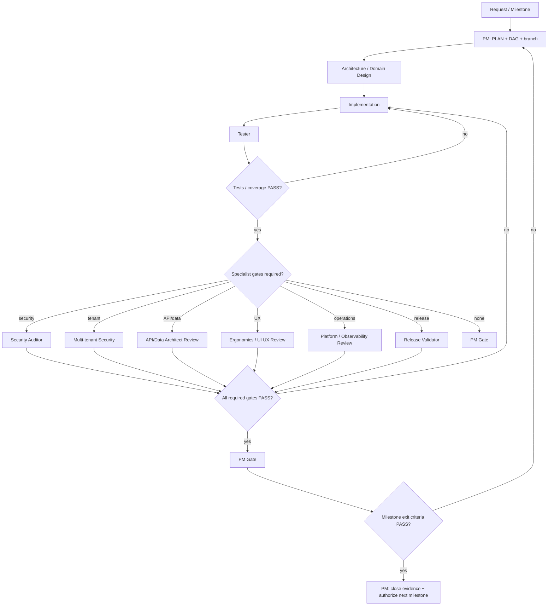

# Agentic Workflow — Governed Delivery Graph

Halcova's agents are nodes, specialist handoffs are edges, shared task context is state, and the Project Manager is the accountable orchestrator. The canonical authority model is `docs/agents/responsibility-matrix.md`; the rationale is ADR-0014.

## Governance rules

- **PM is accountable for delivery**, scope, sequencing, delegation, risk and milestone advancement.
- **PM is not a technical veto authority.** It cannot convert a mandatory specialist FAIL into PASS.
- Security, tenant-isolation, required testing, API/data, architecture and defined critical UX gates are independently controlled by specialist agents.
- An implementation agent must not approve its own security or quality gate.
- A failed gate loops work back to the responsible implementer or design authority.
- Future milestones are not automatically authorized because capacity exists; advance only after the current milestone passes its exit gates in #355.
- Governance changes affecting authority, veto rights, separation of duties, or milestone advancement require an ADR and corresponding update to the responsibility matrix and this skill.

## Agent inventory and authority

The following is the canonical operational roster. Names must match the repository agent definitions; do not invent substitute roles.

| Agent | Primary responsibility | Authority / gate |
|---|---|---|
| **Project Manager** | Scope, prioritisation, sequencing, delegation, dependencies, risk, milestone decisions | **Accountable for delivery; cannot override mandatory specialist FAIL** |
| **Whole Stack Architect** | End-to-end architecture and cross-layer design | Architecture gate |
| **Front End Architect** | React/frontend architecture and component boundaries | Frontend architecture gate |
| **Data Architect** | Data model, schema, migrations, isolation and reconciliation | Data/migration gate |
| **Platform Architect** | Deployment, infrastructure and operational topology | Platform/operational gate |
| **Offline Architect** | Offline-first architecture, consistency and sync model | Offline/sync architecture gate |
| **API Contract Reviewer** | API contracts, compatibility, errors and idempotency | API contract gate |
| **Front End Developer** | Frontend implementation | No authority over own quality/security gate |
| **Runout Engineer** | Cross-app implementation, catalog/scanner/PWA integration | No authority over own quality/security gate |
| **Catalog Designer** | Collection-kind/domain design | Domain design authority within assigned scope; architecture/security still govern |
| **Scanner Builder** | Camera/barcode/scanner implementation | No authority over own security/quality gate |
| **Netlify Backend** | Netlify functions, Blobs, auth/admin/PWA backend implementation | No authority over own security/quality gate |
| **Sync Engineer** | IndexedDB persistence, mutation queues, push/pull sync, retries | Implementation authority only; Offline Architect owns architecture |
| **Tester** | Automated tests, regression, coverage and QA evidence | **Blocking quality gate** |
| **Security Auditor** | Application security, threat modelling and negative security tests | **Blocking security gate** |
| **Multi-tenant Security** | Tenant isolation, membership, IDOR and privilege boundaries | **Blocking tenant-security gate** |
| **Ergonomics Reviewer** | Accessibility, mobile ergonomics, discoverability and critical UX review | **Blocking gate for explicitly critical UX** |
| **UI UX Expert** | Product UI/UX design and Figma/design-system work | Design authority/input; critical UX independently reviewed by Ergonomics Reviewer |
| **Observability Engineer** | Logging, metrics, diagnostics and operational evidence | Operational evidence authority; Platform Architect governs topology |
| **Release Validator** | Build, tests, coverage, security evidence, migrations and release/PWA readiness | **Blocking release-readiness gate when assigned** |
| **Agent Developer** | Agents, prompts, skills and agent-system implementation | Implementation authority only; governance changes require ADR/PM approval |
| **Marketing Manager** | Positioning, messaging, GTM and product communication | Product/GTM input; no technical or security override |

### Authority hierarchy

```text
Project Manager
  │
  ├── accountable for delivery, scope, sequencing and milestone advancement
  │
  ├── Architecture authority
  │     ├── Whole Stack Architect
  │     ├── Front End Architect
  │     ├── Data Architect
  │     ├── Platform Architect
  │     ├── Offline Architect
  │     └── API Contract Reviewer
  │
  ├── Security authority
  │     ├── Security Auditor
  │     └── Multi-tenant Security
  │
  ├── Quality / release authority
  │     ├── Tester
  │     └── Release Validator
  │
  ├── Experience authority
  │     ├── Ergonomics Reviewer
  │     └── UI UX Expert
  │
  ├── Delivery specialists
  │     ├── Front End Developer
  │     ├── Runout Engineer
  │     ├── Catalog Designer
  │     ├── Scanner Builder
  │     ├── Netlify Backend
  │     └── Sync Engineer
  │
  ├── Operations evidence
  │     └── Observability Engineer
  │
  ├── Agent-system governance
  │     └── Agent Developer
  │
  └── Product / GTM
        └── Marketing Manager
```

### Non-overridable rule

The PM may resolve scope, sequencing and trade-off conflicts, but **may not declare a milestone complete when a mandatory security, architecture, testing, API/data, release, or explicitly critical UX gate is FAIL**.

A specialist must provide evidence for PASS. Documentation-only assertions are insufficient for security and quality gates.

## State passed on every handoff

At minimum pass:
- goal and milestone;
- ticket + parent epic;
- branch/PR context;
- files/components/API surfaces;
- dependencies and entry criteria;
- relevant ADRs;
- security classification;
- expected acceptance/evidence;
- previous gate verdicts and residual risks.

## Canonical execution graph



## Mandatory gates

### Security
Changes touching auth, authorization, user data, payments, storage, caching, external APIs or databases require `Security Auditor`. Tenant-isolation changes also require `Multi-tenant Security`. Threat modelling and negative tests are mandatory evidence.

### Testing
`Tester` owns the quality verdict. The configured 70% coverage threshold must pass. Required regression tests must pass before completion.

### Architecture
Relevant architecture agents review before implementation where an architecture boundary changes. Accepted ADRs are constraints unless explicitly superseded by a new ADR.

### UX
For M2 critical journeys and other explicitly gated user experiences, `Ergonomics Reviewer` provides the acceptance verdict. Accessibility and mobile ergonomics are not optional polish.

### API/data/operations
API compatibility, migration safety, rollback, backup/restore, observability and operational readiness are gated when applicable.

### Release
`Release Validator` validates the release evidence bundle when assigned. It does not replace Security Auditor, Tester or Architecture authority; it verifies that their required evidence exists and that build/test/coverage/migration/PWA readiness checks pass.

## Separation of duties

- An implementation agent must not approve its own security or quality gate.
- `Agent Developer` cannot unilaterally redefine agent authority or veto rights.
- `Release Validator` cannot waive a failed specialist gate.
- `Marketing Manager` cannot override security, architecture, quality or accessibility constraints.
- The PM cannot convert a specialist FAIL into PASS without the specialist re-reviewing new evidence.

## Loops

- Security FAIL → remediate → Security re-review.
- Tenant-security FAIL → remediate → Multi-tenant Security re-review.
- Test/coverage FAIL → implementer/tester loop.
- Architecture FAIL → design/implementation loop.
- API/data FAIL → contract/data loop.
- UX FAIL → design/implementation loop.
- Release validation FAIL → remediate evidence/implementation → Release Validator re-review.
- Build/lint FAIL → implementer loop.

No gate may be silently waived.

## Milestone protocol

For each milestone from #355:

1. PM verifies entry criteria and scope.
2. PM decomposes work and assigns agents using the responsibility matrix.
3. Architecture/domain agents produce required decisions.
4. Implementers execute.
5. Tester and specialist gates collect evidence.
6. Release Validator verifies release readiness when applicable.
7. PM records PASS/HOLD/FAIL and residual risk.
8. Only PASS authorizes the next milestone; the next milestone is re-groomed using evidence from the completed one.

## Checklist

- [ ] Governance docs loaded.
- [ ] PM owns plan and milestone accountability.
- [ ] Specialist authority identified.
- [ ] No agent approves its own work where an independent gate is required.
- [ ] State passed across every handoff.
- [ ] Security gate applied whenever required.
- [ ] Required architecture/data/API/UX/quality gates identified.
- [ ] Required specialist gates PASS.
- [ ] Release Validator PASS when release readiness is in scope.
- [ ] `npm run lint`, `npm test`, `npm run test:coverage`, `npm run build` pass when applicable.
- [ ] Evidence and residual risks recorded.
- [ ] PM advances only after milestone exit criteria PASS.
