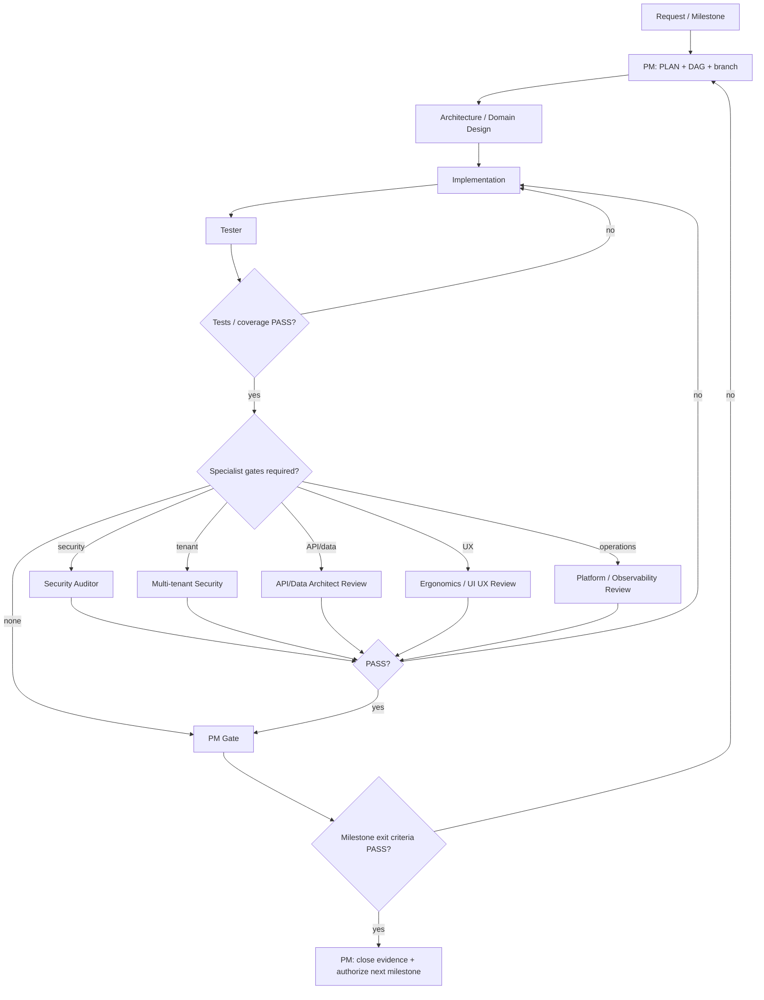

# Agentic Workflow — Governed Delivery Graph

Halcova's agents are nodes, specialist handoffs are edges, shared task context is state, and the Project Manager is the accountable orchestrator. The canonical authority model is `docs/agents/responsibility-matrix.md`; the rationale is ADR-0014.

## Governance rules

- **PM is accountable for delivery**, scope, sequencing, delegation, risk and milestone advancement.
- **PM is not a technical veto authority.** It cannot convert a mandatory specialist FAIL into PASS.
- Security, tenant-isolation, required testing, API/data, architecture and defined critical UX gates are independently controlled by specialist agents.
- An implementation agent must not approve its own security or quality gate.
- A failed gate loops work back to the responsible implementer or design authority.
- Future milestones are not automatically authorized because capacity exists; advance only after the current milestone passes its exit gates in #355.

## Agent inventory and authority

| Node | Primary responsibility | Gate authority |
|---|---|---|
| Project Manager | plan, delegate, coordinate, milestone decision | milestone accountability; cannot override specialist FAIL |
| Whole Stack Architect | end-to-end architecture | architecture gate |
| Front End Architect | frontend architecture | frontend architecture gate |
| Data Architect | schema/migrations/isolation | data/migration gate |
| Platform Architect | deployment/operations | operational readiness gate |
| Offline Architect | offline/sync | sync architecture gate |
| API Contract Reviewer | API compatibility/contracts | API contract gate |
| Front End Developer / Runout Engineer | implementation | none over own work |
| Catalog Designer | collection-type design | domain design input |
| Scanner Builder | scanner implementation | specialist input |
| Netlify Backend | functions/Blobs/auth/PWA implementation | none over own work |
| Tester | tests, regression, coverage | required quality gate |
| Security Auditor | application security | **blocking security gate** |
| Multi-tenant Security | tenant isolation | **blocking tenant-security gate** |
| Ergonomics Reviewer | UX/a11y review | **blocking gate for defined critical UX** |
| UI UX Expert | design/Figma/UX | design authority; critical UX independently reviewed |
| Observability Engineer | logs/metrics/diagnostics | operational evidence |
| Agent Developer | agents/prompts/skills | agent-system implementation; governance changes require ADR |
| Marketing Manager | positioning/GTM/content | product-truth input; no technical override |

## State passed on every handoff

At minimum pass:
- goal and milestone;
- ticket + parent epic;
- branch/PR context;
- files/components/API surfaces;
- dependencies and entry criteria;
- relevant ADRs;
- security classification;
- expected acceptance/evidence;
- previous gate verdicts and residual risks.

## Canonical execution graph

## Mandatory gates

### Security
Changes touching auth, authorization, user data, payments, storage, caching, external APIs or databases require `Security Auditor`. Tenant-isolation changes also require `Multi-tenant Security`. Threat modelling and negative tests are mandatory evidence.

### Testing
`Tester` owns the quality verdict. The configured 70% coverage threshold must pass. Required regression tests must pass before completion.

### Architecture
Relevant architecture agents review before implementation where an architecture boundary changes. Accepted ADRs are constraints unless explicitly superseded by a new ADR.

### UX
For M2 critical journeys and other explicitly gated user experiences, `Ergonomics Reviewer` provides the acceptance verdict. Accessibility and mobile ergonomics are not optional polish.

### API/data/operations
API compatibility, migration safety, rollback, backup/restore, observability and operational readiness are gated when applicable.

## Loops

- Security FAIL → remediate → Security re-review.
- Tenant-security FAIL → remediate → Multi-tenant Security re-review.
- Test/coverage FAIL → implementer/tester loop.
- Architecture FAIL → design/implementation loop.
- API/data FAIL → contract/data loop.
- UX FAIL → design/implementation loop.
- Build/lint FAIL → implementer loop.

No gate may be silently waived.

## Milestone protocol

For each milestone from #355:

1. PM verifies entry criteria and scope.
2. PM decomposes work and assigns agents using the responsibility matrix.
3. Architecture/domain agents produce required decisions.
4. Implementers execute.
5. Tester and specialist gates collect evidence.
6. PM records PASS/HOLD/FAIL and residual risk.
7. Only PASS authorizes the next milestone; the next milestone is re-groomed using evidence from the completed one.

## Checklist

- [ ] Governance docs loaded.
- [ ] PM owns plan and milestone accountability.
- [ ] Specialist authority identified.
- [ ] No agent approves its own work where an independent gate is required.
- [ ] State passed across every handoff.
- [ ] Security gate applied whenever required.
- [ ] Required specialist gates PASS.
- [ ] `npm run lint`, `npm test`, `npm run test:coverage`, `npm run build` pass when applicable.
- [ ] Evidence and residual risks recorded.
- [ ] PM advances only after milestone exit criteria PASS.
