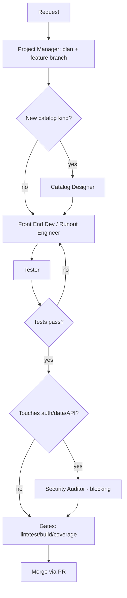

# Agentic Workflow (Graph)

Runout already has the pieces of an agentic graph: agents
(`.github/agents/`) are the nodes, the routing table in `.github/ai/README.md`
and `project-manager.agent.md` are the edges, and the Project Manager is the
runner. This skill turns that prose into an executable graph so every feature
follows the same traversal.

## When to Use
- Plan or execute a feature/refactor end-to-end through the team.
- Define the DAG (nodes, state, edges) before delegating work.
- Enforce the blocking security gate and the lint/test/build gates as graph
  edges.

## Graph Model
- **Node** = one agent doing one task (one role, one scope).
- **Edge** = a handoff. The data that flows along it is **state**.
- **Conditional edge** = branching on a verdict (security surface? tests pass?).
- **Loop edge** = a failed gate routes back to an earlier node.
- **Terminal** = the merge gate (PR open, all gates green).

## Nodes (agent inventory)
| Node | Owns | Produces |
|---|---|---|
| `Project Manager` | plan, branch, delegation, gates | plan, todo, branch |
| `Whole Stack Architect` | architecture/cloud/backend design | ADR / design |
| `Front End Architect` | front-end design/review | component/design review |
| `Front End Developer` / `Runout Engineer` | implement UI/features | code + tests |
| `Catalog Designer` | new collection kind | catalog module |
| `Scanner Builder` | camera + zxing-wasm | scanner code |
| `Netlify Backend` | functions/Blobs/auth/PWA | backend code |
| `Tester` | tests, QA, coverage | test evidence |
| `Security Auditor` / `Multi-tenant Security` | blocking security review | verdict |
| `Ergonomics Reviewer` / `UI UX Expert` | UX/a11y review | findings |
| `Agent Developer` | agents/prompts/skills | team files |

## State Schema
Shared context passed along edges (keep it in the todo + handoff notes):
- `goal`, `feature branch`, `ticket + epic` (required per repo policy)
- `files changed`, `item shape / API contract`
- `tests run`, `coverage %`, `lint/test/build result`
- `security verdict`, `open tickets`

## Edge Rules (routing)
Route by role first, then specialist (see the `.github/ai/README.md` routing
table and `project-manager.agent.md` role mapping). Key edges:
- Design/architecture → `Front End Architect` / `Whole Stack Architect`
- Implementation → `Front End Developer` (or `Runout Engineer` when no
  specialist fits)
- New catalog kind → `Catalog Designer` → `Front End Developer`
- Backend (functions/Blobs/auth/PWA) → `Netlify Backend`
- Scanner → `Scanner Builder`
- Tests/coverage → `Tester`
- Security → `Security Auditor` (blocking)
- Agent/prompt/skill work → `Agent Developer`

## Conditional Edges & Loops
- **Security gate (blocking)** — if the change touches auth, authorization,
  user data, payments, storage, caching, external APIs, or databases, route to
  `Security Auditor` (or `Multi-tenant Security` for tenant isolation) before
  done. May not be skipped.
- **Test loop** — `Tester` fail → back to the implementing node.
- **Coverage loop** — below 70% (`npm run test:coverage`) → back to `Tester` /
  implementer.
- **Build/lint loop** — `npm run lint` / `npm run build` fail → back to the
  implementer.

## The Canonical Graph

## Procedure (running the graph)
1. Delegate the goal to the `Project Manager` (or act as it): load
   `.github/copilot-instructions.md` + this skill.
2. Emit the plan as a DAG (nodes → owner → edge/verdict) and mirror it in the
   todo list.
3. Create the feature branch off `main` first (`feature-branching` skill).
4. Walk nodes in dependency order; at each node, hand off **state** (goal,
   branch, files, verdicts so far) and collect its output.
5. At conditional edges, follow the verdict; on loops, route back and re-run.
6. Stop only when every gate is green and the security gate (if triggered) has
   a blocking pass. Then open the PR.

## Checklist
- [ ] Plan expressed as nodes + edges, mirrored in the todo list
- [ ] Feature branch created off `main` before any implementation
- [ ] Each node handed the state (goal/branch/files/verdicts)
- [ ] Security gate applied whenever the change touches protected surfaces
- [ ] Loops followed (test/coverage/lint/build) until green
- [ ] Gates run: `npm run lint`, `npm test`, `npm run test:coverage` (>70%),
      `npm run build`
- [ ] PR opened (not a direct push to `main`)
