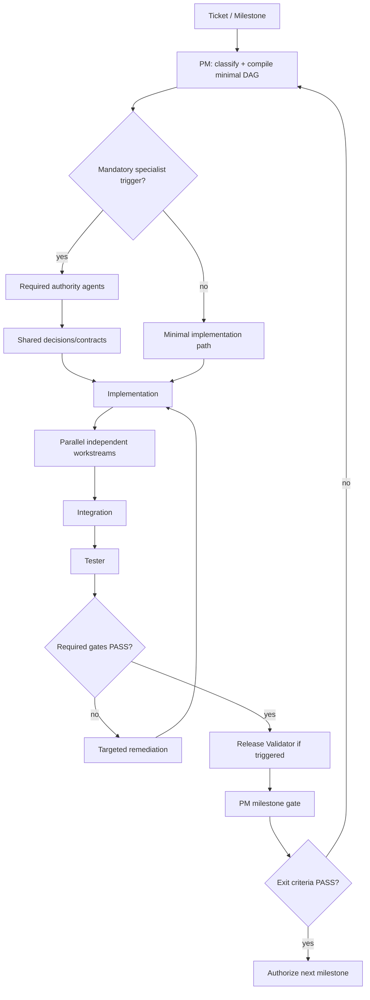

# Agentic Workflow — Governed Delivery Graph

Halcova's agents are nodes, specialist handoffs are edges, shared task context is state, and the Project Manager is the accountable orchestrator. The canonical authority model is `docs/agents/responsibility-matrix.md`; the rationale is ADR-0014.

## Runtime v2 (compact operational layer)

Load `.github/agent-runtime/kernel.md` first for every task. The compact
operational rules live in `.github/agent-runtime/`:

- `kernel.md` — authority, gates, budgets, escalation (load first).
- `routing.md` — deterministic routing matrix + dormant-agent rules (canonical for the routing table below).
- `handoff.md` — compressed handoff + evidence-cache rules.
- `validation.md` — incremental validation ladder.
- `state/` — PM milestone state.

This skill remains the execution protocol (adaptive DAG, parallel work, loops,
milestone protocol). The routing table below is a summary; `routing.md` is the
canonical deterministic matrix.

## Governance rules

- **PM is accountable for delivery**, scope, sequencing, delegation, risk and milestone advancement.
- **PM is not a technical veto authority.** It cannot convert a mandatory specialist FAIL into PASS.
- Security, tenant-isolation, required testing, API/data, architecture and defined critical UX gates are independently controlled by specialist agents.
- An implementation agent must not approve its own security or quality gate.
- A failed gate loops work back to the responsible implementer or design authority.
- Future milestones are not automatically authorized because capacity exists; advance only after the current milestone passes its exit gates in #355.
- Governance changes affecting authority, veto rights, separation of duties, or milestone advancement require an ADR and corresponding update to the responsibility matrix and this skill.
- **Token/context efficiency is a delivery constraint, not a quality shortcut.** Agents MUST minimize unnecessary context while preserving correctness, security, architecture, testing and required evidence.
- **The PM is the graph compiler:** for each ticket/workstream it selects the smallest safe set of agents and gates required by deterministic trigger rules.

## Agent inventory and authority

The following is the canonical operational roster. Names must match the repository agent definitions; do not invent substitute roles.

| Agent | Primary responsibility | Authority / gate |
|---|---|---|
| **Project Manager** | Scope, prioritisation, sequencing, delegation, dependencies, risk, milestone decisions | **Accountable for delivery; cannot override mandatory specialist FAIL** |
| **Whole Stack Architect** | End-to-end architecture and cross-layer design | Architecture gate |
| **Front End Architect** | React/frontend architecture and component boundaries | Frontend architecture gate |
| **Data Architect** | Data model, schema, migrations, isolation and reconciliation | Data/migration gate |
| **Platform Architect** | Deployment, infrastructure and operational topology | Platform/operational gate |
| **Offline Architect** | Offline-first architecture, consistency and sync model | Offline/sync architecture gate |
| **API Contract Reviewer** | API contracts, compatibility, errors and idempotency | API contract gate |
| **Front End Developer** | Frontend implementation | No authority over own quality/security gate |
| **Runout Engineer** | Cross-app implementation, catalog/scanner/PWA integration | No authority over own quality/security gate |
| **Catalog Designer** | Collection-kind/domain design | Domain design authority within assigned scope; architecture/security still govern |
| **Scanner Builder** | Camera/barcode/scanner implementation | No authority over own security/quality gate |
| **Netlify Backend** | Netlify functions, Blobs, auth/admin/PWA backend implementation | No authority over own security/quality gate |
| **Sync Engineer** | IndexedDB persistence, mutation queues, push/pull sync, retries | Implementation authority only; Offline Architect owns architecture |
| **Tester** | Automated tests, regression, coverage and QA evidence | **Blocking quality gate** |
| **Security Auditor** | Application security, threat modelling and negative security tests | **Blocking security gate** |
| **Multi-tenant Security** | Tenant isolation, membership, IDOR and privilege boundaries | **Blocking tenant-security gate** |
| **Ergonomics Reviewer** | Accessibility, mobile ergonomics, discoverability and critical UX review | **Blocking gate for explicitly critical UX** |
| **UI UX Expert** | Product UI/UX design and Figma/design-system work | Design authority/input; critical UX independently reviewed by Ergonomics Reviewer |
| **Observability Engineer** | Logging, metrics, diagnostics and operational evidence | Operational evidence authority; Platform Architect governs topology |
| **Release Validator** | Build, tests, coverage, security evidence, migrations and release/PWA readiness | **Blocking release-readiness gate when assigned** |
| **Agent Developer** | Agents, prompts, skills and agent-system implementation | Implementation authority only; governance changes require ADR/PM approval |
| **Marketing Manager** | Positioning, messaging, GTM and product communication | Product/GTM input; no technical or security override |

### Authority hierarchy

```text
Project Manager
  │
  ├── accountable for delivery, scope, sequencing and milestone advancement
  │
  ├── Architecture authority
  │     ├── Whole Stack Architect
  │     ├── Front End Architect
  │     ├── Data Architect
  │     ├── Platform Architect
  │     ├── Offline Architect
  │     └── API Contract Reviewer
  │
  ├── Security authority
  │     ├── Security Auditor
  │     └── Multi-tenant Security
  │
  ├── Quality / release authority
  │     ├── Tester
  │     └── Release Validator
  │
  ├── Experience authority
  │     ├── Ergonomics Reviewer
  │     └── UI UX Expert
  │
  ├── Delivery specialists
  │     ├── Front End Developer
  │     ├── Runout Engineer
  │     ├── Catalog Designer
  │     ├── Scanner Builder
  │     ├── Netlify Backend
  │     └── Sync Engineer
  │
  ├── Operations evidence
  │     └── Observability Engineer
  │
  ├── Agent-system governance
  │     └── Agent Developer
  │
  └── Product / GTM
        └── Marketing Manager
```

### Non-overridable rule

The PM may resolve scope, sequencing and trade-off conflicts, but **may not declare a milestone complete when a mandatory security, architecture, testing, API/data, release, or explicitly critical UX gate is FAIL**.

A specialist must provide evidence for PASS. Documentation-only assertions are insufficient for security and quality gates.

## Persistent team layer (ADR-0018)

Between the PM and individual specialists, work runs through **persistent
teams** that keep their domain context across issues and milestones.

```text
USER → MASTER PM → persistent specialist teams → GitHub issues/PRs → MASTER PM → human merge/decision
```

Teams: SECURITY · OFFLINE · COLLECTOR · DATA · PROVIDERS · AI (dormant) ·
GROWTH (dormant). Full scopes: `docs/adr/0018-persistent-multi-team-delivery.md`.

Team rules:

- The PM assigns the next READY issue to the existing team; never recreate a
  team per issue.
- A team implements only in-scope issues; out-of-scope → `OUT OF SCOPE` → PM.
- Teams do not coordinate directly; communication is via GitHub issue/PR, ADR,
  compact state and the PM (GitHub is the handoff bus).
- One issue = one branch = one PR (`mN/<team>/<issue>`); human merge authority.
- Specialists inside a team stay dormant until their trigger applies.
- Team checkpoints: `.github/agent-runtime/state/teams/<team>.md`; portfolio:
  `.github/agent-runtime/state/ROADMAP.md` + `M1.md`…`M4.md`.

## Adaptive Agent Graph Protocol

The PM MUST build a **minimal safe DAG** for every ticket or workstream before assigning agents. The graph is adaptive: agents are added because deterministic ticket characteristics trigger their responsibility or because a dependency requires them.

### Ticket classification

Classify each ticket by:

- domain: frontend / backend / data / platform / scanner / catalog / sync / agent-system / product;
- complexity: low / medium / high;
- architecture impact: none / local / cross-layer;
- security impact: none / application / tenant / sensitive-data;
- data impact: none / query / schema / migration / reconciliation;
- API impact: none / consumer-visible / contract-breaking / idempotency;
- offline impact: none / cache / local-write / sync / conflict;
- UX impact: none / normal / critical journey / accessibility;
- operational impact: none / observability / deployment / rollback;
- release impact: none / release-critical;
- dependencies and milestone constraints.

If classification is uncertain, use the safer routing and obtain the smallest specialist clarification needed.

### Deterministic routing rules

| Trigger | Mandatory specialist(s) |
|---|---|
| Cross-layer architecture change | Whole Stack Architect |
| React/frontend architecture boundary | Front End Architect |
| Schema, migration, reconciliation or data model change | Data Architect |
| Deployment/infrastructure/topology change | Platform Architect |
| Offline cache, local writes, sync or conflict semantics | Offline Architect |
| Consumer-visible API or compatibility change | API Contract Reviewer |
| Auth, authorization, sensitive user data, storage, caching, external API or database security boundary | Security Auditor |
| Tenant/membership/IDOR/privilege boundary | Multi-tenant Security |
| Critical mobile journey or accessibility gate | Ergonomics Reviewer |
| Product UI/UX design work | UI UX Expert |
| Logging/metrics/diagnostics/operational evidence | Observability Engineer |
| Release/build/PWA/deployment readiness | Release Validator |
| Automated regression/coverage requirement | Tester |
| Agent/skill/prompt/governance change | Agent Developer + PM; ADR when governance changes |
| Collection-kind/domain model design | Catalog Designer |
| Scanner/camera/barcode capability | Scanner Builder |
| Netlify functions/Blobs/auth/PWA backend | Netlify Backend |
| IndexedDB/outbox/push-pull/retry implementation | Sync Engineer |

These are mandatory routing rules. The PM may add agents for risk or dependencies but may not omit a mandatory specialist triggered by the ticket.

### Gate-by-exception

Do **not** invoke every specialist for every ticket. Invoke the minimum graph satisfying deterministic routing rules, dependencies and milestone exit criteria. Record ambiguous omissions.

### Minimal graph examples

```text
Low-risk UI:
PM → Front End Developer → Tester → PM

Frontend architecture:
PM → Front End Architect → Front End Developer → Tester → PM

Offline synchronization:
PM → Offline Architect → triggered Data/API specialists
  → Sync Engineer / Backend → Tester + Security Auditor
  → Release Validator if release-critical → PM

Tenant authorization:
PM → Security Auditor + Multi-tenant Security → Backend
  → Tester → Security re-review → PM
```

### Independent review

Implementation agents never provide their own mandatory security or quality approval.

## State passed on every handoff

At minimum pass:
- goal and milestone;
- ticket + parent epic;
- branch/PR context;
- files/components/API surfaces;
- dependencies and entry criteria;
- relevant ADRs;
- security classification;
- expected acceptance/evidence;
- previous gate verdicts and residual risks.

**Handoff rule:** pass the minimum sufficient state, not the entire prior conversation or repository context. Link/reference canonical documents instead of copying them into prompts where possible.

## Context and token efficiency protocol

Agents MUST optimize for **minimum sufficient context**. Token efficiency must never weaken security, correctness, architecture, testing, accessibility or required evidence.

### Context acquisition

- Start with the ticket, acceptance criteria, relevant parent epic and triggered ADRs.
- Inspect targeted files, symbols, directories and tests before opening large files or the entire repository.
- Use search to locate relevant symbols/references before reading broad code areas.
- Read only the sections needed for the current decision or implementation.
- Do not preload every agent definition, ADR, issue or source file when the task does not require it.
- Expand context progressively when evidence shows that more is needed.
- If required context is genuinely missing, request or retrieve it rather than guessing.

### Context reuse

- Treat `docs/agents/responsibility-matrix.md`, ADRs and canonical backlog items as sources of truth; reference them instead of duplicating their contents.
- Reuse valid prior gate results and test evidence when the underlying code and assumptions have not changed.
- Do not repeat an investigation already completed by another agent unless the evidence is stale, contradictory or specifically requires independent verification.
- PM state should be a compact execution record, not a transcript of every agent interaction.

### Handoff compression

Use the canonical compressed handoff contract in
`.github/agent-runtime/handoff.md`:

```text
STATUS: PASS | FAIL | HOLD | NOT VERIFIED
ISSUE:
PR:
DECISION:
EVIDENCE:
RISKS:
NEXT:
```

Do not paste large source files, full logs, issue descriptions, ADRs or
complete prior conversations into downstream prompts when a concise summary
plus file references is sufficient. Evidence-cache reuse rules also live in
`.github/agent-runtime/handoff.md`.

### Parallel-agent budget

Parallelism must not multiply redundant investigation.

- Launch an agent only when its work is unblocked and materially useful.
- Do not have multiple agents independently answer the same question without a defined reason for independent review.
- Avoid starting downstream agents merely to keep them busy; waiting is preferable to consuming context on blocked work.
- Prefer one authoritative architecture decision over several duplicate design explorations.
- For expensive validation, run the narrowest relevant checks first, then expand only if failures or risk justify it.

### Output discipline

Agents should return concise, evidence-oriented results rather than long narratives.

A completed implementation handoff should normally contain outcome, changed files/components, tests/checks run, evidence/results, unresolved risks and next required gate. Do not reproduce code or logs unless the exact excerpt is required.

### Safety boundary

Token optimization is **never** a reason to skip security review, tenant-isolation validation, architecture decisions, mandatory tests/coverage, required accessibility/ergonomics review, release validation, or evidence needed to substantiate PASS.

If context is insufficient for a reliable gate decision, the agent MUST obtain more context or return `NOT VERIFIED`; it must not infer PASS to save tokens.

## Parallel execution protocol

The PM MUST identify independent workstreams and execute them concurrently when dependencies permit. Parallelism is a delivery optimization, not a relaxation of governance.

### Before parallel execution

1. Establish required architecture and domain decisions.
2. Establish shared API, domain, persistence, sync and error contracts.
3. Identify file/component ownership boundaries.
4. Identify dependencies and integration points.
5. Create one branch per implementation workstream.
6. Define required validation gates for each workstream.

### Parallelism is prohibited when

- architecture, data, API or synchronization semantics are unresolved;
- two agents would independently define the same contract or domain model;
- a change has an unresolved security boundary;
- one workstream depends on behavior that another workstream has not yet defined;
- parallel work would create unsafe concurrent migrations or incompatible schema/API changes.

### Branch and PR isolation

For parallel implementation:

- one implementation workstream → one branch;
- one branch → one focused PR where practical;
- implementation agents do not share a mutable feature branch;
- the PM owns integration ordering;
- merge conflicts or semantic contract conflicts return to the relevant architecture/implementation owners.

### Workstream ownership record

Every parallel workstream should record owner agent, branch, files/components/API surfaces owned, dependencies, consumers, integration point, required validation agents and expected evidence.

### Parallel completion model

```text
READY → IN PROGRESS → WAITING → READY FOR REVIEW → VALIDATED → INTEGRATED → DONE
```

Independent work may occupy these states concurrently. The PM must avoid unnecessary serialization while preserving dependency order and specialist gates.

### Milestone versus workstream sequencing

**Milestones remain sequential:** `M0 → M1 → M2 → M3 → M4 → M5 → M6`

Work inside a milestone may be highly parallel. Do not start a later milestone
merely because independent work remains in the current milestone. Strategic
progression remains gate-driven.

Exception (ADR-0018): a later milestone may run an explicitly unblocked
workstream when dependencies are satisfied, architecture gates permit it and
file ownership does not conflict — never by consuming a blocked dependency
merely to increase parallelism.

## Canonical execution graph



## Mandatory gates

### Security
Changes touching auth, authorization, user data, payments, storage, caching, external APIs or databases require `Security Auditor`. Tenant-isolation changes also require `Multi-tenant Security`. Threat modelling and negative tests are mandatory evidence.

### Testing
`Tester` owns the quality verdict. The configured 70% coverage threshold must pass. Required regression tests must pass before completion.

### Architecture
Relevant architecture agents review before implementation where an architecture boundary changes. Accepted ADRs are constraints unless explicitly superseded by a new ADR.

### UX
For M2 critical journeys and other explicitly gated user experiences, `Ergonomics Reviewer` provides the acceptance verdict. Accessibility and mobile ergonomics are not optional polish.

### API/data/operations
API compatibility, migration safety, rollback, backup/restore, observability and operational readiness are gated when applicable.

### Release
`Release Validator` validates the release evidence bundle when assigned. It does not replace Security Auditor, Tester or Architecture authority; it verifies that their required evidence exists and that build/test/coverage/migration/PWA readiness checks pass.

## Separation of duties

- An implementation agent must not approve its own security or quality gate.
- `Agent Developer` cannot unilaterally redefine agent authority or veto rights.
- `Release Validator` cannot waive a failed specialist gate.
- `Marketing Manager` cannot override security, architecture, quality or accessibility constraints.
- The PM cannot convert a specialist FAIL into PASS without the specialist re-reviewing new evidence.

## Loops

- Security FAIL → remediate → Security re-review.
- Tenant-security FAIL → remediate → Multi-tenant Security re-review.
- Test/coverage FAIL → implementer/tester loop.
- Architecture FAIL → design/implementation loop.
- API/data FAIL → contract/data loop.
- UX FAIL → design/implementation loop.
- Release validation FAIL → remediate evidence/implementation → Release Validator re-review.
- Build/lint FAIL → implementer loop.

No gate may be silently waived.

## Milestone protocol

For each milestone from #355:

1. PM verifies entry criteria and scope.
2. PM classifies tickets and compiles minimal safe DAGs.
3. PM assigns agents using deterministic responsibility triggers.
4. Required architecture/domain/contract agents decide before dependent implementation.
5. PM establishes branch and ownership boundaries.
6. Independent implementation workstreams execute concurrently where permitted.
7. PM coordinates integration at explicit contract boundaries.
8. Tester and triggered specialist gates collect evidence.
9. Release Validator verifies readiness when applicable.
10. PM records PASS/HOLD/FAIL and residual risk.
11. Only PASS authorizes the next milestone; the next milestone is re-groomed using evidence from the completed one.

## Checklist

- [ ] Governance docs loaded.
- [ ] PM owns plan and milestone accountability.
- [ ] Ticket classification completed.
- [ ] Minimal safe DAG compiled.
- [ ] Mandatory specialist triggers identified and none omitted.
- [ ] No unnecessary specialist agents launched.
- [ ] No agent approves its own work where an independent gate is required.
- [ ] Minimum sufficient context used.
- [ ] Canonical documents referenced rather than unnecessarily copied.
- [ ] No redundant investigations consume context.
- [ ] Architecture/contracts established before dependent parallel work.
- [ ] Parallel workstreams have clear ownership and branches.
- [ ] Required specialist gates PASS.
- [ ] Required tests/coverage/build checks pass.
- [ ] Evidence and residual risks recorded.
- [ ] PM advances only after milestone exit criteria PASS.
