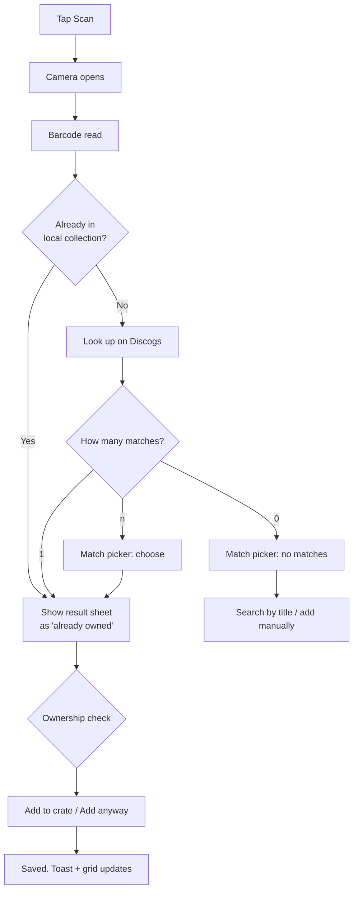
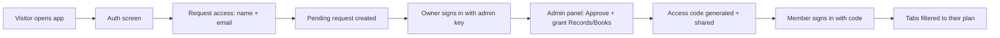

# Alcove — Functional Documentation

This document describes **what Alcove does** from a user's point of view: the
features, screens, flows, states, and edge cases. For *how* it's built, see
[`technical.md`](technical.md).

- [1. Overview](#1-overview)
- [2. Feature inventory](#2-feature-inventory)
- [3. Screens & components](#3-screens--components)
- [4. User flows](#4-user-flows)
- [5. Duplicate detection](#5-duplicate-detection)
- [6. States & feedback](#6-states--feedback)
- [7. Error handling](#7-error-handling)
- [8. Platform behavior](#8-platform-behavior)

---

## 1. Overview

Alcove lets people catalog **records** and **books** by scanning barcodes with
their phone camera. It is a client-side progressive web app (PWA): no
app-store download, no passwords. Access is by **admin approval** — visitors
request access, the site owner approves them from an admin screen and grants
each member **Records and/or Books**, and members sign in with an access code.
Two separate collections are supported, chosen by a tab in the header:

| Tab | What you catalog | Lookup source | Token required? |
| --- | --- | --- | --- |
| **Records** | LP/EP/CD/7"/12" releases | Discogs database | Yes — personal access token |
| **Books** | Books by ISBN | Google Books | No — public API |

Both collections share the same interaction model — scan or search, confirm the
match, see what you already own, add, filter, sort, view details, add notes,
remove. The wording ("crate" vs "shelf") and the visual layout adapt per tab.

---

## 2. Feature inventory

| ID | Feature | Where | Notes |
| --- | --- | --- | --- |
| F-01 | Barcode scanning | Scanner modal | EAN-13, EAN-8, UPC-A, UPC-E, Code 128 |
| F-02 | Record lookup by barcode | Discogs | Requires token |
| F-03 | Book lookup by ISBN | Google Books | No token |
| F-04 | Multi-match picker | Match picker sheet | Several pressings/editions to choose from |
| F-05 | Text search fallback | "Find it another way" | Title / artist / author |
| F-06 | Manual entry | "Add by hand" form | No lookup needed |
| F-07 | Duplicate detection | Scan result sheet | Exact / same album / same artist |
| F-08 | Collection grid | Grid view | Responsive card grid |
| F-09 | Search within collection | Toolbar | Title, label, catalog #, genre |
| F-10 | Filter by format | Toolbar chips | Records only |
| F-11 | Filter by genre/category | Toolbar chips | Derived from your items |
| F-12 | Filter by artist/author | Toolbar select | Derived from your items |
| F-13 | Sort | Toolbar select | Added / Artist / Year / Format / Title |
| F-14 | Detail sheet | Detail modal | Metadata, tracklist/description, notes |
| F-15 | Notes per item | Detail modal | Saved on blur, server-backed |
| F-16 | Remove item | Detail modal | Two-step confirmation |
| F-17 | Discogs/Google Books link | Detail modal | Deep link to the source |
| F-18 | Settings (Discogs token) | Settings modal | Stored in `localStorage`, removable |
| F-19 | Offline shell | PWA service worker | App + cached API responses |
| F-20 | Install as PWA | Home screen | Standalone, portrait, own icon |
| F-21 | Request access | Auth screen | Name + email → pending request |
| F-22 | Sign in with access code | Auth screen | `RU-XXXX-XXXX-XXXX` code |
| F-23 | Admin panel | Admin sheet (shield) | Approve/reject requests, manage members |
| F-24 | Per-member plans | Admin panel | Grant Records and/or Books per member |
| F-25 | Manage members | Admin panel | Change access, disable, delete, show code |
| F-26 | Sign out | Header user chip | Clears the local session |

---

## 3. Screens & components

### 3.1 Header

Always visible. Shows the **Alcove** wordmark, a tagline that matches the active
tab ("your crate, cataloged" / "your shelf, cataloged"), a **Records | Books**
tab bar, and a gear button that opens Settings.

### 3.2 Collection view (main screen)

The body of each tab is one collection screen:

- **Empty state** — shown when the collection has no items yet. Explains how to
  add your first item and offers a **Scan** button.
- **Toolbar** — only shown once the collection has at least one item. Contains:
  - a search box (placeholder per tab, e.g. "Search your crate…") with a live
    item count,
  - **format chips** (records only): `LP`, `EP`, `CD`, `7"`, `12"` — toggleable,
  - a **sort** dropdown (see [F-13](#2-feature-inventory)),
  - a **genre/category** chip row (records) built from the distinct genres
    present in your collection,
  - an **artist/author** dropdown built from the distinct artists present,
  - a **Clear** chip that appears when any filter is active.
- **Grid** — a responsive card grid. Record cards show a vinyl "peek" badge
  colored by format, the sleeve/cover, album title and artist. Book cards show
  the cover, title and author.
- **Floating "Scan" button** — always visible when the collection is non-empty;
  the primary way to add items.

### 3.3 Scanner modal

A full-screen camera overlay with a barcode targeting reticle. It:

1. requests the **rear camera** (`facingMode: 'environment'`),
2. downscales frames to ≤640px wide and decodes ~5 times/second,
3. vibrates (where supported) and closes as soon as a supported barcode is read.

A **"Enter details manually instead"** link routes to the manual entry flow, and
an ✕ closes the scanner. If the camera permission is denied, a specific message
is shown.

### 3.4 Match picker sheet

Shown when a lookup returns more than one candidate (or when a text search
returns results). Lists each candidate with cover, `Artist - Title`, format ·
year · label, and catalog # (or ISBN for books). Actions:

- tap a row → treat it as the scan result (duplicate detection),
- **Search by title instead** (when reached from a barcode scan),
- **Add manually**.

### 3.5 Scan result sheet

The confirmation screen. Shows the candidate's cover, title, artist, and
metadata, plus an **ownership banner** (see [Section 5](#5-duplicate-detection))
and sections for *other pressings you own* and *more by this artist*. Actions:

- **Scan next** — go straight back to the scanner,
- **Add** / **Add anyway** — save to the collection,
- **View in collection →** — when the exact item is already owned, opens it.

### 3.6 Manual add sheet

Three modes in one sheet:

1. **Search** — free-text query against Discogs / Google Books.
2. **Picking** — reuses the match picker; **Skip search — add it by hand**
   goes to the form.
3. **Form** — fields to add the item by hand. Records: artist, title (required),
   format, year, label, catalog #, genre. Books: author, title (required), year,
   publisher, category.

### 3.7 Detail sheet

Opens when you tap any item in the grid (or "View in collection"). Shows:

- cover (or a letter placeholder),
- title and artist/author,
- metadata definition list — format, year, label/publisher, catalog # / ISBN,
  country (records), pages (books), genre/category,
- records: the **tracklist**, fetched from the Discogs release on demand;
  books: the **description** and page count, fetched on demand if not already
  present,
- a **notes** textarea (autosaved on blur),
- a deep link to the source ("View on Discogs ↗" / "View on Google Books ↗"),
- a **Remove from crate/shelf** button with a two-step confirm.

### 3.8 Settings modal

A small sheet to manage the **Discogs personal access token**:

- shows a masked placeholder if a token is stored,
- **Save** persists it to `localStorage` (only enabled when changed),
- **Remove token** clears it,
- help text explains where to get a token, and that books need none.

> The token is stored **per user** (keyed by the signed-in account), so each
> member pastes their own and switching accounts never leaks one.

### 3.9 Auth screen

The first screen a visitor sees, with the Alcove wordmark and two actions:

- **I have an access code** — a code field (`RU-XXXX-XXXX-XXXX`) plus
  **Sign in**. Wrong codes show an inline error; disabled accounts explain
  they should ask the admin.
- **Request access** — a name + email form. On submit, a **"Request sent"**
  confirmation explains the admin will approve it and send a code.

### 3.10 Admin panel (owner only)

Reached from the **shield** icon in the header — visible only when signed in
with the admin key. It has two sections:

- **Pending requests** — each shows name, email, and when it was requested,
  with **Approve** and **Reject**. Approving opens a "Grant access" panel with
  **Records** and **Books** checkboxes (at least one required) and a
  **Generate access code** button, which then shows the `RU-…` code with a
  **Copy** button to share.
- **Members** — each row shows name, email, and toggleable **Records/Books**
  access chips, plus **Show code** (re-reveal a lost code), **Disable/Enable**,
  and **Delete** (confirmation required; deletes their stored collections).

### 3.11 Header additions

The header now also shows:

- a **user chip** with the signed-in user's initial — tapping it signs out,
- the **shield** (admin panel) for the owner,
- only the **tabs the member is entitled to** (e.g. a Records-only member sees
  no Books tab).

---

## 4. User flows

### 4.1 Scan-to-add (records)

Key details:

- If the scanned barcode exactly matches an item already in your collection, the
  app answers **instantly from local data** — no network call — and shows the
  "already owned" result.
- If the lookup returns a single result, it skips the picker and goes straight
  to the result sheet.
- If no Discogs token is set, the app opens Settings with a toast explaining a
  token is required.

### 4.2 Scan-to-add (books)

Same flow, but the lookup is against Google Books by ISBN, and no token is
required. Single results skip the picker; multiple editions go to the picker.
Duplicate detection uses the ISBN and Google Books volume ID.

### 4.3 Text search fallback

From the scanner (or picker) → **"Search by title instead"** → type a query →
results shown in the match picker → pick one → result sheet → add.

### 4.4 Manual add

From the scanner → **"Enter details manually instead"** (or "Add manually" from
the picker) → search is offered first, but can be skipped → fill the form →
the item is run through the same duplicate detection → add.

### 4.5 Manage an item

Tap a card → detail sheet → edit **notes** (autosaved on blur) → **Remove** →
confirm → item is deleted from the collection and the server. A toast
confirms the removal.

### 4.6 Filter & sort

The toolbar operates entirely on data already loaded in the browser:

- **Search** matches against title, label, catalog #, and genre (case-insensitive).
- **Format chips** (records) filter on the item's format type.
- **Genre chips** filter items that have any selected genre.
- **Artist/author** dropdown filters on the exact artist/author name.
- **Sort** options differ per tab (records: added/artist/year/format; books:
  added/author/title/year).
- **Clear** resets search, formats, genres, and artist together.

The **item count** in the toolbar reflects the filtered result set, not the
whole collection.

### 4.7 Request access → approval → sign in

- A pending request can be submitted once per email; submitting again returns
  the existing request.
- Approval **requires** at least one collection (Records and/or Books).
- The generated code is shown once with a Copy button; it can be re-revealed
  later from the Members list.

### 4.8 Manage members (owner)

- **Change plan** — tap the Records/Books chip to grant or revoke; the member's
  next refresh reflects it (a revoked tab disappears; the backend also refuses
  writes to a kind they no longer have).
- **Disable / Enable** — a disabled member is signed out on their next session
  revalidation and can't read/write; re-enabling restores access.
- **Delete** — requires confirmation and permanently removes the member and
  their stored collections (both kinds).

### 4.9 Sign out

The header user chip signs the current user out (clears the local session). The
next person on the same device sees the auth screen again.

---

## 5. Duplicate detection

Every path into adding (barcode auto-match, picker selection, text search, manual
entry) funnels through the same check before anything is saved. Given the
candidate, it classifies what you already own:

| Classification | Meaning | Banner tone | Add button |
| --- | --- | --- | --- |
| **Exact duplicate** | Same Discogs release ID, same Google Books volume ID, **or** same barcode/ISBN | Owned | **Add anyway** |
| **Same album/edition** | Same title+artist under a different pressing/format, or same title+author in a different edition | Caution | **Add** |
| **New item** | Not owned in any form; no same-artist match | Good | **Add** |

The result sheet also shows:

- **Other pressings you own** — same album, different pressing/format,
- **More by {artist} in your crate (n)** — other albums by the same artist.

These are derived by splitting the stored `"Artist - Title"` string and comparing
normalized artist and album names.

---

## 6. States & feedback

| State | What the user sees |
| --- | --- |
| Collection loading | "Loading your crate…" / "Loading your shelf…" |
| Collection error | Error message + **Try again** button |
| Collection empty | Empty state with scan CTA |
| No results (filtered) | "Nothing matches — try a different search or clear the filters." |
| Scanner starting | "Starting camera…" then "Aim at the barcode" |
| Camera denied | Specific "Camera access was denied" message |
| Lookup in progress | "Looking it up on Discogs / Google Books…" |
| Lookup no matches | "No matches found on Discogs / Google Books." |
| Lookup error | Inline error message in the picker |
| Add success | Toast: "Added to your crate" / "Added to your shelf" |
| Add failure | Toast: "Could not save — check your connection" |
| Remove success | Toast: "Removed" |

Toasts auto-dismiss after ~2.4 seconds.

---

## 7. Error handling

| Situation | Behavior |
| --- | --- |
| No Discogs token | Opens Settings + toast "Add a Discogs token first…" |
| Rejected token (401) | "Discogs token was rejected. Check it in Settings." |
| Rate limited (429) | "Discogs rate limit hit — wait a moment and try again." |
| Other lookup HTTP error | "Discogs request failed (nnn)" / generic Google Books message |
| Camera permission denied | Static message in the scanner overlay |
| Collection API unreachable | Error state on the main screen with a **Try again** button |
| Save/update/delete failure | Optimistic UI is rolled back; the operation re-throws |

---

## 8. Platform behavior

- **PWA install** — served over HTTPS; installable from Safari (iOS) and other
  supporting browsers. Runs standalone (`display: standalone`), portrait, with
  its own icon set and `#16130F` theme color.
- **Offline** — the app shell (JS/CSS/HTML/WASM/icons) is precached by the
  service worker. Discogs and Google Books API responses are cached with
  **NetworkFirst**, and their images with **CacheFirst** (30-day expiry, capped
  entries). The collection itself is server-backed, so it is **not** mirrored
  offline — but already-scanned barcodes match from local state with no network.
- **iOS specifics** — the barcode decoder (WASM ZXing) is chosen specifically
  because it decodes 1D barcodes reliably on iOS Safari; the camera requires a
  secure context (`localhost` or HTTPS).
- **Persistence** — the Discogs token is stored in `localStorage` on the device
  only. Collection data is stored server-side in Netlify Blobs and survives
  reinstalls/clearing browser data.
