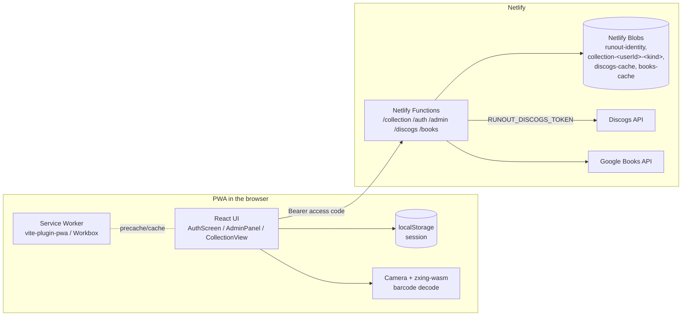
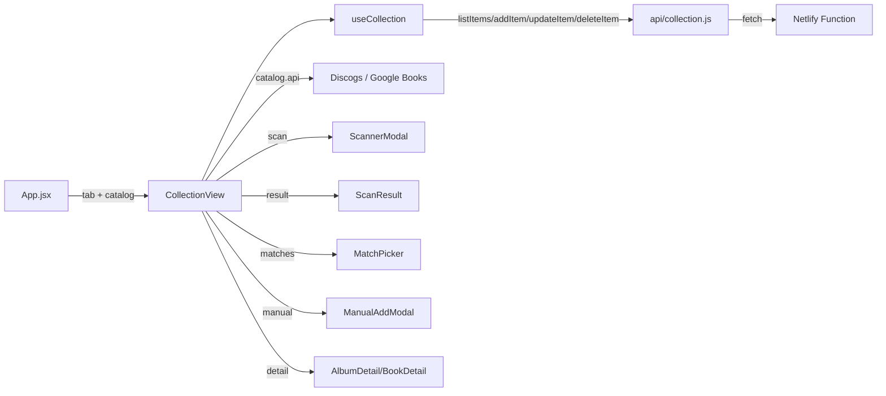

# Halcova — Technical Documentation

This document describes **how Halcova is built**: architecture, data model, APIs,
offline/PWA strategy, and the deployment pipeline. For *what the app does*, see
[`functional.md`](functional.md).

- [1. Architecture overview](#1-architecture-overview)
- [2. Tech stack](#2-tech-stack)
- [3. Project structure](#3-project-structure)
- [4. Data model](#4-data-model)
- [5. Backend: Netlify Function + Blobs](#5-backend-netlify-function--blobs)
- [6. Frontend architecture](#6-frontend-architecture)
- [7. The "catalog" abstraction](#7-the-catalog-abstraction)
- [8. Barcode scanning (zxing-wasm)](#8-barcode-scanning-zxing-wasm)
- [9. Duplicate detection logic](#9-duplicate-detection-logic)
- [10. PWA & offline strategy](#10-pwa--offline-strategy)
- [11. External APIs](#11-external-apis)
- [12. Deployment](#12-deployment)
- [13. Security & privacy](#13-security--privacy)
- [14. Tooling & scripts](#14-tooling--scripts)

---

## 1. Architecture overview

Halcova is a **React 19 SPA** built with Vite, deployed as a **static site + a
small set of Netlify Functions** on Netlify.



Two boundaries matter:

1. **Lookup APIs (Discogs, Google Books)** are called **from the browser via
   server-side function proxies** (`/discogs`, `/books`), which authorize each
   request with the caller's access code. The Discogs token
   (`RUNOUT_DISCOGS_TOKEN`) is owned by the site and lives only on the proxy —
   never in `localStorage`. The proxies cache responses in the shared
   `discogs-cache` / `books-cache` Blob stores.
2. **Persistence and auth** go through the Netlify Functions, which read/write
   Netlify Blobs. Every call is authenticated with the caller's access code and
   served from that user's own stores — which is what makes collections
   independent of a single browser/device *and* isolated per user.

---

## 2. Tech stack

| Concern | Technology | Why |
| --- | --- | --- |
| Framework | React 19 (`^19.2.8`) | Component UI |
| Build | Vite 8 (`^8.2.0`) | Fast dev server, ESM, plugin ecosystem |
| PWA | `vite-plugin-pwa` (`^1.3.0`) | Manifest + Workbox service worker |
| Barcode decoding | `zxing-wasm` (`^3.1.2`) | WASM ZXing port; reliable 1D decode on iOS Safari |
| Server-side storage | `@netlify/blobs` (`^10.7.12`) | Blob stores from within the Functions |
| Auth | Access codes + admin key | No passwords; admin-issued codes |
| Lookup APIs | Discogs REST, Google Books REST | Public web APIs, no SDKs |
| Linting | `oxlint` (`^1.75.0`) | Fast Rust-based linter |
| Testing | `vitest` + Testing Library + jsdom | Unit/component tests (see §14) |

---

## 3. Project structure

```
├── index.html                     # App shell: meta, viewport, theme-color,
│                                  #   apple-mobile-web-app tags, Google Fonts
├── netlify.toml                   # Build command, publish dir, functions dir,
│                                  #   SPA redirect, esbuild bundler for functions
├── vite.config.js                 # React + PWA plugin, dev proxy to netlify dev
├── public/
│   ├── favicon.png                # Tab icon
│   ├── apple-touch-icon.png       # iOS home-screen icon
│   ├── icon-192.png               # PWA icon (any)
│   ├── icon-512.png               # PWA icon (any)
│   └── icon-maskable-512.png      # PWA icon (maskable)
├── netlify/functions/
│   ├── collection.js              # CRUD API over Netlify Blobs (auth-gated)
│   ├── auth.js                    # Request access / sign in / session validation
│   ├── admin.js                   # Admin API (approve requests, manage members)
│   ├── discogs.js                 # Discogs lookup proxy (single server-side token + shared cache)
│   ├── books.js                   # Google Books lookup proxy (shared cache, no token)
│   └── _shared/                   # auth.js + users.js helpers (bundled, not deployed)
└── src/
    ├── main.jsx                   # React root + shared CSS
    ├── App.jsx                    # Auth gate + tabs + settings/admin shell
    ├── AuthScreen.jsx             # Sign in / request access
    ├── AdminPanel.jsx             # Admin screen (requests, members, plans)
    ├── App.css / index.css        # Global styles
    ├── styles/shared.css          # Shared primitives (buttons, sheets, chips…)
    ├── CollectionView.jsx         # The whole collection screen (one per tab)
    ├── catalog.js                 # recordsCatalog / booksCatalog config
    ├── api/
    │   ├── discogs.js             # Discogs proxy client (Bearer auth, normalization)
    │   ├── books.js               # Google Books proxy client (Bearer auth, normalization)
    │   ├── auth.js                # Auth + admin API client
    │   └── collection.js          # Netlify Function client (Bearer auth)
    ├── hooks/
    │   ├── useAuth.js             # Session state (login/logout/request access)
    │   └── useCollection.js       # items + status + optimistic add/update/remove
    ├── utils/
    │   ├── match.js               # splitArtistTitle, normalize, findRelated
    │   └── session.js             # Persisted access-code session (localStorage)
    └── components/
        ├── Header.jsx             # Wordmark, tabs, settings gear, admin shield, sign-out
        ├── Toolbar.jsx            # Search, format/genre chips, artist, sort, clear
        ├── EmptyState.jsx         # Empty + no-results states
        ├── ScannerModal.jsx       # Camera + zxing-wasm decode loop
        ├── MatchPicker.jsx        # Multi-match list sheet
        ├── ScanResult.jsx         # Ownership banner + related sections
        ├── ManualAddModal.jsx     # Records: search → pick → hand form
        ├── BookManualAddModal.jsx # Books: search → pick → hand form
        ├── AlbumCard.jsx / BookCard.jsx
        ├── AlbumGrid.jsx / BookGrid.jsx   # BookGrid reuses AlbumGrid.css
        ├── AlbumDetail.jsx / BookDetail.jsx
        └── SettingsModal.jsx      # Help/settings sheet (no token field)
```

---

## 4. Data model

Both records and books are stored as the **same flat item shape**, which is what
lets one collection engine drive both tabs.

| Field | Records | Books | Notes |
| --- | --- | --- | --- |
| `id` | `randomUUID()` | same | Server-generated on create |
| `title` | `"Artist - Album"` | `"Author - Title"` | Convention: `Artist - Title` |
| `year` | release year | publication year | Books: year extracted from full date |
| `label` | label | publisher | |
| `catno` | catalog number | ISBN | Books also keep `isbn` |
| `formatRaw` | raw format string | `''` | |
| `formatType` | `LP/EP/CD/7"/12"/Other` | `''` | Drives format chips + badges |
| `genre` | array | categories array | |
| `style` | array | `[]` | |
| `country` | release country | `''` | |
| `coverImage` | cover URL | thumbnail URL | Books: upgraded to HTTPS |
| `barcode` | cleaned barcode | ISBN | Used for local instant match |
| `discogsId` / `googleBooksId` | release ID | volume ID | Used for exact-match detection |
| `resourceUrl` | Discogs resource URL | Google volume selfLink | |
| `infoLink` | — | Google Books link | Books only |
| `description` / `pageCount` | — | book description / pages | Books only |
| `dateAdded` | ISO timestamp | same | Defaults to server time |
| `notes` | free text | same | User-editable, autosaved |

### Barcode normalization

- **Records**: `cleanBarcode` strips everything except `0-9Xx`
  (`String(raw).replace(/[^0-9Xx]/g, '')`) — a barcode with internal spaces breaks
  Discogs' search otherwise.
- **Books**: `cleanIsbn` does the same so EAN-13/ISBN-10 scans unify on digits.

---

## 5. Backend: Netlify Functions + Blobs

The "server" is **five Netlify Functions** sharing helper modules, all backed
by Netlify Blobs (no database to provision):

| Function | Purpose | Auth |
| --- | --- | --- |
| `netlify/functions/collection.js` | CRUD for a signed-in user's collections | `Authorization: Bearer <access code>` |
| `netlify/functions/auth.js` | Request access, sign in, validate session | none / bearer for `me` |
| `netlify/functions/admin.js` | Admin panel: approve requests, manage members | `Authorization: Bearer <admin key>` |
| `netlify/functions/discogs.js` | Discogs lookup proxy (single server-side token, shared cache) | `Authorization: Bearer <access code>` |
| `netlify/functions/books.js` | Google Books lookup proxy (shared cache, no token) | `Authorization: Bearer <access code>` |

Shared helpers live in `netlify/functions/_shared/` (`auth.js`: admin key,
bearer parsing, `publicUser`, code generation; `users.js`: identity store CRUD
+ per-member store naming). Files in the underscore folder are bundled into each
function by esbuild, never deployed as functions themselves.

### Identity store

A single `runout-identity` blob store holds users and signup requests:

- `user:<id>` → `{ id, name, email, code, collections:{records,books},
  role:'admin'|'member', status:'active'|'disabled', createdAt }`
- `request:<id>` → `{ id, name, email, status:'pending'|'approved'|'rejected',
  createdAt }`
- `index:users` / `index:requests` — ordered id lists.

**Access codes** are `RU-XXXX-XXXX-XXXX` strings (generated with `node:crypto`,
no ambiguous chars) stored in plaintext so an admin can re-reveal a lost code;
they are stripped with `publicUser` before anything reaches the client. The
**admin key** comes from `RUNOUT_ADMIN_KEY` (dev fallback
`runout-dev-admin-key` — never ship that). The owner's identity is the constant
`owner`.

### Collection stores (per user)

Records and books never mix, and neither do users:

- **Owner** (`id === 'owner'`): the original `runout-collection` /
  `runout-library` stores — existing data needs **zero migration**.
- **Member**: an isolated `collection-<userId>-<kind>` store per collection
  kind.

`storeNameFor(userId, collection)` in `_shared/users.js` maps this; deleting a
member calls `deleteUserCollections` to clear both of their stores.

Each store keeps the same simple layout: one `index` key (ordered id list) and
one `item:<id>` blob per item (JSON).

### API surface

**`collection`** (all requests authenticated and permission-checked first):
`authorize(req)` resolves the Bearer code to the owner (admin key) or a member
(`findUserByCode`), then 401s on unknown/missing codes, 403s on disabled
accounts or a collection the user's plan doesn't include, and 400s on unknown
collection kinds.

| Method | Path | Behavior |
| --- | --- | --- |
| `GET` | `/collection?collection=…` | Read index, fetch all items, return `{ items: [...] }` |
| `POST` | `/collection?collection=…` | Generate `randomUUID()`, stamp `dateAdded`, store, `unshift` ID into index, return `201` + item |
| `PUT` | `/collection?collection=…&id=…` | Merge `{...existing, ...patch, id}`; `400` if no id, `404` if missing |
| `DELETE` | `/collection?collection=…&id=…` | Delete blob + remove from index; `400` if no id |

**`auth`**:

| Action | Behavior |
| --- | --- |
| `POST { action:'request', name, email }` | Create a pending request (dedupes pending requests by email) |
| `POST { action:'login', code }` | Resolve code → user profile (member or admin); 401 unknown, 403 disabled |
| `GET` (Bearer) | `me` — revalidate a cached session on app start |

**`admin`** (admin key required): `GET` lists requests + users; `POST` actions
`approve` (returns the generated access code), `reject`, `updateUser`
(collections / status), `deleteUser` (removes the record + their collection
stores). The owner account can't be edited or deleted.

Responses are always JSON via a small `json()` helper; unexpected errors return
`500` with the message.

### Local development

- `netlify dev` serves the functions locally and wires up Blobs automatically.
- The Vite dev server proxies `/.netlify/functions` → `http://localhost:8888`
  (the default `netlify dev` port) so `npm run dev` alone also works for the
  frontend.
- You need a session to call the collection API: sign in with the admin key or
  a member code.
- `netlify.toml` sets `node_bundler = "esbuild"` for the function build.

---

## 6. Frontend architecture

### 6.1 State flow



- **`App.jsx`** owns the auth gate and the active tab (`'records' | 'books'`).
  Without a session it renders `AuthScreen`; with one it renders `Header`
  (tabs filtered to the member's granted collections), `CollectionView`
  **keyed by catalog kind** so switching tabs remounts a fresh collection, and
  — for the owner — the `AdminPanel`. A signed-in user with no granted
  collections gets a friendly "ask the admin" screen instead of a broken view.
- **`useAuth`** owns the session: `login(code)` (persisted to
  `localStorage.runout.session`), `logout()`, `requestAccess(...)`, and a
  startup revalidation via `authApi.me()` — a disabled/revoked account is
  signed out, while an offline launch keeps the cached session.
- **`CollectionView.jsx`** is the orchestrator. It holds a `modal` state machine:
  `'scan' | 'pick' | 'manual' | 'result' | 'detail'` plus supporting state
  (`pickerState`, `scanCandidate`, `selectedItem`, toast, filters, sort).
- **`useCollection`** is a custom hook that owns `items`, `status`
  (`loading | ready | error`) and `error`. It performs **optimistic updates**
  for `update` and `remove` (rolls back the previous items array on failure) and
  prepends newly-added items locally.

### 6.2 Filtering & sorting

All derived in `useMemo` in `CollectionView` from the already-loaded `items`:

- **Search** — case-insensitive substring over `title`, `label`, `catno`, and
  `genre`.
- **Format** — equality on `formatType` (records).
- **Genre** — any-of on `genre`.
- **Artist** — exact equality on the artist half of the title
  (`splitArtistTitle`).
- **Sort** — `added` (by `dateAdded` desc), `artist` (artist then title),
  `year` (desc), `format`, `title`. Record and book catalogs expose their own
  sort option lists.

Distinct **genres** and **artists** are also derived in `useMemo` and drive the
chip/select filters.

### 6.3 API clients

- **`api/discogs.js`** — calls the `discogs` function proxy
  (`/.netlify/functions/discogs`) with the access code as
  `Authorization: Bearer <code>`; it no longer calls `https://api.discogs.com`
  directly or carries any per-user token. The proxy owns the single
  `RUNOUT_DISCOGS_TOKEN`, sends the `User-Agent`, and caches in the shared
  `discogs-cache` blob store. This module maps the proxy's errors
  (`SERVER_NO_TOKEN`, `BAD_TOKEN`, `RATE_LIMIT`, `HTTP_ERROR`) and normalizes
  the returned JSON into the item shape (search results and release details —
  tracklist, notes, images). `parseFormatType` infers a coarse
  `LP/EP/CD/7"/12"/Other` from the raw format array.
- **`api/books.js`** — calls the `books` function proxy
  (`/.netlify/functions/books`) with the access code as Bearer; the proxy hits
  the public Google Books `v1` endpoints and serves from the shared
  `books-cache` blob store. This module normalizes the returned volumes into
  the shared item shape, upgrades thumbnail URLs `http → https`
  (mixed-content), and reduces published dates to the year.
- **`api/collection.js`** — thin `fetch` wrapper around the Netlify Function;
  builds the URL with `collection` and `id` params, attaches
  `Authorization: Bearer <code>` (from `utils/session`), and unwraps error
  bodies.
- **`api/auth.js`** — client for the `auth` + `admin` functions: request
  access, login (code in the body — pre-auth), `me()` (revalidate + persist
  session), logout, and the admin actions (`adminList`, `adminApprove`,
  `adminReject`, `adminUpdateUser`, `adminDeleteUser`), all of which send the
  admin key as a Bearer header.

### 6.4 Sessions & token management

- **Session** — `utils/session.js` persists `{ user, code }` at
  `localStorage.runout.session`. `getAccessCode()` feeds the Bearer header on
  every API call; `getUserId()` namespaces per-user settings.
- **Discogs token** — centralized: the site owns a single
  `RUNOUT_DISCOGS_TOKEN` env var, set **server-side** on the `discogs` lookup
  proxy (`netlify/functions/discogs.js`). Users never bring or paste tokens
  and nothing is stored in the browser. Lookups are cached in the shared
  `discogs-cache` / `books-cache` Blob stores, so identical lookups by
  different users are served from cache instead of hitting the provider again
  (barcode/release and ISBN/detail: 30 days; text search: 1 day). If the site
  hasn't configured `RUNOUT_DISCOGS_TOKEN`, record lookups surface
  `SERVER_NO_TOKEN`.
- `ScannerModal` is loaded with `React.lazy` + `Suspense` so the ~heavy WASM
  decoder only downloads when the user actually taps **Scan**.
- The scanner no longer gates on a stored token: records and books both route
  through the function proxies (which authorize with the access code), so the
  only lookup failure mode is `SERVER_NO_TOKEN` when the shared Discogs token
  is missing.

---

## 7. The "catalog" abstraction

`src/catalog.js` exports `recordsCatalog` and `booksCatalog` — plain objects
that describe everything a shared flow needs to know about a kind of thing:

```js
{
  kind: 'records' | 'books',
  entity: 'record' | 'book',
  collectionLabel: 'crate' | 'shelf',
  storage: 'records' | 'books',        // which blob store / useCollection arg
  api: discogs | books,                 // lookup client module
  getDetail: discogs.getReleaseDetail | books.getBookDetail,
  lookupName: 'Discogs' | 'Google Books',
  formats: [...],                       // format chips (books: [])
  genreLabel, artistLabel, artistPlaceholder,
  sortOptions: [...],
  components: { Card, Grid, Detail, ManualAdd },
  detailLink: (item) => url,
  copy: { emptyTitle, addToast, resultGood, sameHeading, ... } // all UI copy
}
```

`CollectionView`, `Toolbar`, `EmptyState`, `ScanResult`, and the detail
components consume this config, which is how one code path renders both records
and books without per-kind branches.

---

## 8. Barcode scanning (zxing-wasm)

`ScannerModal.jsx` implements a custom camera loop:

1. **Init** — `prepareZXingModule({ overrides: { locateFile } })` is called at
   module load so the `.wasm` is served from **our own bundle** (via the
   `?url` Vite import) instead of a CDN — reliable and precached by the PWA.
2. **Camera** — `getUserMedia({ video: { facingMode: 'environment' } })`,
   streamed into a `<video playsInline muted>`.
3. **Frame loop** — a `requestAnimationFrame` loop throttled to a decode every
   `180ms` (~5/s) draws the video frame to an off-screen `<canvas>` downscaled
   to ≤640px wide, then calls `readBarcodes(imageData, options)`.
4. **Formats** — `EAN13, EAN8, UPCA, UPCE, Code128` with `tryHarder: true`,
   `maxNumberOfSymbols: 1`.
5. **Hit** — cancels the loop, stops the camera tracks, optionally vibrates
   (`navigator.vibrate?.(60)`), and calls `onDetected(text)`.

Every individual frame decode failure is swallowed (a single bad frame is
normal); only camera permission failure surfaces an error message. Cleanup on
unmount cancels the RAF loop and stops tracks.

---

## 9. Duplicate detection logic

`src/utils/match.js`:

- **`splitArtistTitle(title)`** — splits a stored `"Artist - Title"` string on
  the first `" - "` into `{ artist, album }`. Missing separator → `{ artist: '',
  album: title }`.
- **`findRelated(candidate, items)`** — returns `{ ownedExact, sameAlbum,
  otherArtist }`:
  - **ownedExact**: any item whose `discogsId`, `googleBooksId`, **or** `barcode`
    matches the candidate's.
  - **byArtist**: items whose normalized artist equals the candidate's artist
    (excluding the exact match).
  - **sameAlbum**: byArtist items whose normalized album equals the candidate's.
  - **otherArtist**: the rest of byArtist.

This single function powers the ownership banner and the "other pressings you
own" / "more by this artist" sections in `ScanResult`. The **exact-barcode local
match** shortcut in `CollectionView.handleBarcodeDetected` also uses it — a
barcode already in your collection short-circuits the network lookup entirely.

---

## 10. PWA & offline strategy

Configured in `vite.config.js` via `vite-plugin-pwa`:

- **Manifest** — name "Halcova — Records & Books", standalone, portrait,
  `#16130F` theme/background, three icon sizes including a maskable icon.
- **Registration** — `registerType: 'autoUpdate'` (users get new versions
  silently).
- **Precache** — Workbox `globPatterns: ['**/*.{js,css,html,png,svg,ico,wasm}']`
  — note `wasm` so the scanner engine works offline once cached.
- **Runtime caching** (browser never calls `api.discogs.com` or `www.googleapis.com`
  directly — lookups go through the function proxies):
  - `/.netlify/functions/discogs` and `/.netlify/functions/books` (lookup
    proxies) → `NetworkFirst`, 200 entries, 24-hour expiry (`lookup-api`). This
    is a modest client cache so repeat lookups don't re-hit the network; the
    server-side shared Blob cache is the primary dedup, with its own TTLs
    (barcode/release 30 days, text search 1 day).
  - Discogs cover images (image paths on `discogs.com` hosts) → `CacheFirst`,
    500 entries, 30-day expiry (`discogs-images`).
  - `books.google.com` cover images → `CacheFirst`, 500 entries, 30-day expiry
    (`google-books-images`).

The **collection data is intentionally not cached** — it is server-of-record in
Netlify Blobs. Offline, the shell and lookup caches still let the app open, and
already-owned barcodes still match from local state.

`index.html` carries the iOS web-app meta tags (`apple-mobile-web-app-capable`,
`black-translucent` status bar, `Halcova` title) and `theme-color`.

---

## 11. External APIs

### Discogs

- Base: `https://api.discogs.com`
- Endpoints used: `GET /database/search` (by `barcode` or `q`, `type=release`)
  and `GET /releases/{id}` (tracklist, notes, images).
- Access: the browser never calls `api.discogs.com` directly — lookups go
  through the `netlify/functions/discogs.js` proxy, which owns a single
  `RUNOUT_DISCOGS_TOKEN` env var **server-side**. The proxy sends it as an
  `Authorization: Discogs token=<token>` header (plus the required
  `User-Agent`); the token never reaches the browser.
- Client auth: the client authenticates to the proxy with its access code as
  `Authorization: Bearer <code>` (the admin key for the owner). Responses are
  cached in the shared `discogs-cache` Blob store so one user's lookup serves
  the next (barcode/release TTL 30 days, text search 1 day).
- Errors: the proxy maps Discogs `429` → `RATE_LIMIT`, `401` → `BAD_TOKEN`
  (token rejected), a missing `RUNOUT_DISCOGS_TOKEN` → `SERVER_NO_TOKEN`, and
  other failures → `HTTP_ERROR`.

### Google Books

- Base: `https://www.googleapis.com/books/v1`
- Endpoints used: `GET /volumes?q=isbn:…` (barcode lookup), `GET /volumes?q=…`
  (text search), `GET /volumes/{id}` (full description/page count).
- Access: the browser doesn't call Google directly either — lookups go through
  the `netlify/functions/books.js` proxy, which appends `country=US` for
  region-appropriate results and caches responses in the shared `books-cache`
  Blob store.
- Auth: none on Google's side (public API); the proxy uses the same Bearer
  access-code contract as every other function.

---

## 12. Deployment

`netlify.toml`:

```toml
[build]
  command = "npm run build"
  publish = "dist"
  functions = "netlify/functions"

[[redirects]]
  from = "/*"
  to = "/index.html"
  status = 200

[functions]
  node_bundler = "esbuild"
```

- Static build output is `dist/` (includes the generated `manifest.webmanifest`,
  service worker, and precached assets).
- The `/*` → `/index.html` redirect makes the SPA router-safe.
- Netlify Blobs needs **no provisioning**; the Functions' `getStore()` work
  out of the box once deployed.
- **Set `RUNOUT_ADMIN_KEY`** in the Netlify environment before going live —
  the owner signs in with it (see `netlify/functions/_shared/auth.js` for the
  dev fallback). Never commit or log it.
- **Set `RUNOUT_DISCOGS_TOKEN`** too — the `discogs` lookup proxy reads it
  server-side; without it record lookups fail with `SERVER_NO_TOKEN`. Books
  need no token.

Deployment options are covered in the
[README](../README.md#2-deploy-to-netlify): Netlify CLI, drag-and-drop (note:
skips functions), or Git-connected import.

---

## 13. Security & privacy

- **No passwords** — members sign in with an `RU-…` access code that the admin
  issues; the owner signs in with the `RUNOUT_ADMIN_KEY`. There is no signup
  without admin approval.
- **Per-user isolation** — every collection call is authenticated
  (`Authorization: Bearer <code>`) and served from the caller's own blob store
  (`collection-<userId>-<kind>`); a member can't read or write another user's
  data. Collection access is additionally gated by the member's granted
  collections (Records / Books).
- **The admin key and access codes are secrets** — `publicUser` strips the
  `code` field before any user object reaches the client; functions never log
  them. Access codes are stored in plaintext in the private `runout-identity`
  blob store so the admin can re-reveal a lost code — a deliberate trade-off
  at this scale (rotate codes by deleting + recreating a member if needed).
- The **Discogs token is server-only** — the single `RUNOUT_DISCOGS_TOKEN` env
  var lives on the `discogs` lookup proxy and never reaches the browser.
- Users never bring or paste tokens — there is no token field in the Settings
  modal (the old per-user token storage is gone).
- All lookups go through the Netlify function proxies and are cached in shared
  Blob stores (`discogs-cache` / `books-cache`); the browser never calls
  `api.discogs.com` or `www.googleapis.com` directly.
- No tracking, no third-party analytics.
- Camera frames are decoded entirely client-side in WASM — no images are
  uploaded anywhere.
- All traffic is HTTPS in production; camera access additionally requires a
  secure context.

---

## 14. Tooling & scripts

| Command | Action |
| --- | --- |
| `npm run dev` | Vite dev server (`:5173`), proxies functions to `netlify dev` |
| `npm run build` | Production build to `dist/` (PWA assets included) |
| `npm run preview` | Serve the production build locally |
| `npm run lint` | `oxlint` |
| `npm test` | `vitest run` |
| `npm run test:watch` | Vitest watch mode |
| `npm run test:coverage` | Vitest run with v8 coverage |

**Testing** — Vitest + Testing Library (jsdom) live next to the code they
cover: `src/**/*.test.{js,jsx}`. Coverage includes `src/**`, excluding
`src/main.jsx` and `src/test/`. Netlify functions are syntax-checked with
`node --check` but don't have a runner (they're exercised end-to-end with
`netlify dev`).

### Known gotchas

- The app has **no error boundary** — an uncaught render error unmounts React
  (dark screen). Any new data-shape path added to rendering should be exercised
  carefully. The auth/session path is defensive on purpose (missing
  `collections` → friendly screen, never a crash).
- `splitArtistTitle` lives in `src/utils/match.js` and must be imported wherever
  needed (missing imports have caused the dark-screen bug before).
- Every new collection endpoint must be **auth-gated** (Bearer code / admin
  key) and resolved to the caller's store — an unauthenticated or
  cross-user-read endpoint is a security bug, not a style issue.
- Vite's file watcher can serve stale transforms after edits under some
  sandboxed setups — restart the dev server if changes don't appear.
- Installing npm deps inside the macOS VS Code sandbox may need
  `--cache "$TMPDIR/npm-cache"`.
