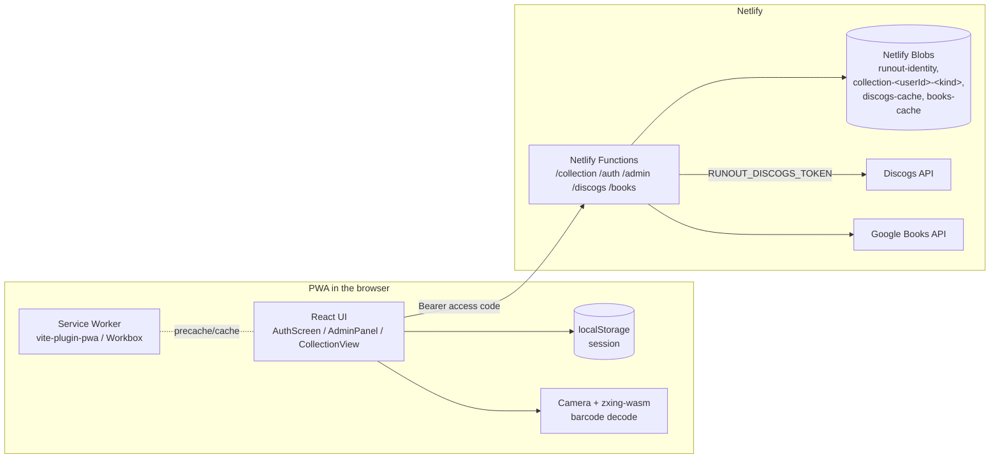
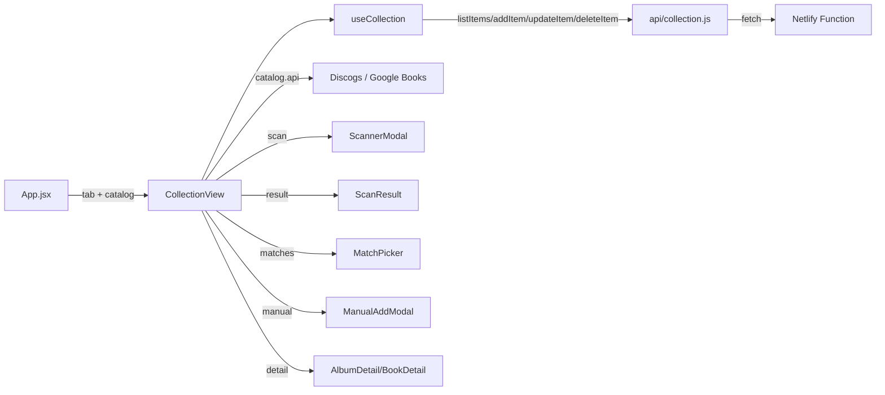

# Halcova — Technical Documentation

This document describes **how Halcova is built**: architecture, data model, APIs,
offline/PWA strategy, and the deployment pipeline. For *what the app does*, see
[`functional.md`](functional.md).

- [1. Architecture overview](#1-architecture-overview)
- [2. Tech stack](#2-tech-stack)
- [3. Project structure](#3-project-structure)
- [4. Data model](#4-data-model)
- [5. Backend: Netlify Function + Blobs](#5-backend-netlify-function--blobs)
- [6. Frontend architecture](#6-frontend-architecture)
- [7. The "catalog" abstraction](#7-the-catalog-abstraction)
- [8. Barcode scanning (zxing-wasm)](#8-barcode-scanning-zxing-wasm)
- [9. Duplicate detection logic](#9-duplicate-detection-logic)
- [10. PWA & offline strategy](#10-pwa--offline-strategy)
- [11. External APIs](#11-external-apis)
- [12. Deployment](#12-deployment)
- [13. Security & privacy](#13-security--privacy)
- [14. Tooling & scripts](#14-tooling--scripts)
- [15. Performance budget (M1)](#15-performance-budget-m1)

---

## 1. Architecture overview

Halcova is a **React 19 SPA** built with Vite, deployed as a **static site + a
small set of Netlify Functions** on Netlify.



Two boundaries matter:

1. **Lookup APIs (Discogs, Google Books)** are called **from the browser via
   server-side function proxies** (`/discogs`, `/books`), which authorize each
   request with the caller's access code. The Discogs token
   (`RUNOUT_DISCOGS_TOKEN`) is owned by the site and lives only on the proxy —
   never in `localStorage`. The proxies cache responses in the shared
   `discogs-cache` / `books-cache` Blob stores.
2. **Persistence and auth** go through the Netlify Functions, which read/write
   Netlify Blobs. Every call is authenticated with the caller's access code and
   served from that user's own stores — which is what makes collections
   independent of a single browser/device *and* isolated per user.

---

## 2. Tech stack

| Concern | Technology | Why |
| --- | --- | --- |
| Framework | React 19 (`^19.2.8`) | Component UI |
| Build | Vite 8 (`^8.2.0`) | Fast dev server, ESM, plugin ecosystem |
| PWA | `vite-plugin-pwa` (`^1.3.0`) | Manifest + Workbox service worker |
| Barcode decoding | `zxing-wasm` (`^3.1.2`) | WASM ZXing port; reliable 1D decode on iOS Safari |
| Server-side storage | `@netlify/blobs` (`^10.7.12`) | Blob stores from within the Functions |
| Auth | Access codes + admin key | No passwords; admin-issued codes |
| Lookup APIs | Discogs REST, Google Books REST | Public web APIs, no SDKs |
| Linting | `oxlint` (`^1.75.0`) | Fast Rust-based linter |
| Testing | `vitest` + Testing Library + jsdom | Unit/component tests (see §14) |

---

## 3. Project structure

```
├── index.html                     # App shell: meta, viewport, theme-color,
│                                  #   apple-mobile-web-app tags, Google Fonts
├── netlify.toml                   # Build command, publish dir, functions dir,
│                                  #   SPA redirect, esbuild bundler for functions
├── vite.config.js                 # React + PWA plugin, dev proxy to netlify dev
├── public/
│   ├── favicon.png                # Tab icon
│   ├── apple-touch-icon.png       # iOS home-screen icon
│   ├── icon-192.png               # PWA icon (any)
│   ├── icon-512.png               # PWA icon (any)
│   └── icon-maskable-512.png      # PWA icon (maskable)
├── netlify/functions/
│   ├── collection.js              # CRUD API over Netlify Blobs (auth-gated)
│   ├── auth.js                    # Request access / sign in / session validation
│   ├── admin.js                   # Admin API (approve requests, manage members)
│   ├── discogs.js                 # Discogs lookup proxy (single server-side token + shared cache)
│   ├── books.js                   # Google Books lookup proxy (shared cache, optional API key)
│   └── _shared/                   # auth.js + users.js helpers (bundled, not deployed)
└── src/
    ├── main.jsx                   # React root + shared CSS
    ├── App.jsx                    # Auth gate + tabs + settings/admin shell
    ├── AuthScreen.jsx             # Sign in / request access
    ├── AdminPanel.jsx             # Admin screen (requests, members, plans)
    ├── App.css / index.css        # Global styles
    ├── styles/shared.css          # Shared primitives (buttons, sheets, chips…)
    ├── CollectionView.jsx         # The whole collection screen (one per tab)
    ├── catalog.js                 # recordsCatalog / booksCatalog config
    ├── api/
    │   ├── discogs.js             # Discogs proxy client (Bearer auth, normalization)
    │   ├── books.js               # Google Books proxy client (Bearer auth, normalization)
    │   ├── auth.js                # Auth + admin API client
    │   └── collection.js          # Netlify Function client (Bearer auth)
    ├── hooks/
    │   ├── useAuth.js             # Session state (login/logout/request access)
    │   └── useCollection.js       # items + status + optimistic add/update/remove
    ├── utils/
    │   ├── match.js               # splitArtistTitle, normalize, findRelated
    │   └── session.js             # Persisted access-code session (localStorage)
    └── components/
        ├── Header.jsx             # Wordmark, tabs, settings gear, admin shield, sign-out
        ├── Toolbar.jsx            # Search, format/genre chips, artist, sort, clear
        ├── EmptyState.jsx         # Empty + no-results states
        ├── ScannerModal.jsx       # Camera + zxing-wasm decode loop
        ├── MatchPicker.jsx        # Multi-match list sheet
        ├── ScanResult.jsx         # Ownership banner + related sections
        ├── ManualAddModal.jsx     # Records: search → pick → hand form
        ├── BookManualAddModal.jsx # Books: search → pick → hand form
        ├── AlbumCard.jsx / BookCard.jsx
        ├── AlbumGrid.jsx / BookGrid.jsx   # BookGrid reuses AlbumGrid.css
        ├── AlbumDetail.jsx / BookDetail.jsx
        └── SettingsModal.jsx      # Help/settings sheet (no token field)
```

---

## 4. Data model

Both records and books are stored as the **same flat item shape**, which is what
lets one collection engine drive both tabs.

| Field | Records | Books | Notes |
| --- | --- | --- | --- |
| `id` | `randomUUID()` | same | Server-generated on create |
| `title` | `"Artist - Album"` | `"Author - Title"` | Convention: `Artist - Title` |
| `year` | release year | publication year | Books: year extracted from full date |
| `label` | label | publisher | |
| `catno` | catalog number | ISBN | Books also keep `isbn` |
| `formatRaw` | raw format string | `''` | |
| `formatType` | `LP/EP/CD/7"/12"/Other` | `''` | Drives format chips + badges |
| `genre` | array | categories array | |
| `style` | array | `[]` | |
| `country` | release country | `''` | |
| `coverImage` | cover URL | thumbnail URL | Books: upgraded to HTTPS |
| `barcode` | cleaned barcode | ISBN | Used for local instant match |
| `discogsId` / `googleBooksId` | release ID | volume ID | Used for exact-match detection |
| `resourceUrl` | Discogs resource URL | Google volume selfLink | |
| `infoLink` | — | Google Books link | Books only |
| `description` / `pageCount` | — | book description / pages | Books only |
| `dateAdded` | ISO timestamp | same | Defaults to server time |
| `notes` | free text | same | User-editable, autosaved |

### Barcode normalization

- **Records**: `cleanBarcode` strips everything except `0-9Xx`
  (`String(raw).replace(/[^0-9Xx]/g, '')`) — a barcode with internal spaces breaks
  Discogs' search otherwise.
- **Books**: `cleanIsbn` does the same so EAN-13/ISBN-10 scans unify on digits.

---

## 5. Backend: Netlify Functions + Blobs

The "server" is **five Netlify Functions** sharing helper modules, all backed
by Netlify Blobs (no database to provision):

| Function | Purpose | Auth |
| --- | --- | --- |
| `netlify/functions/collection.js` | CRUD for a signed-in user's collections | `Authorization: Bearer <access code>` |
| `netlify/functions/auth.js` | Request access, sign in, validate session | none / bearer for `me` |
| `netlify/functions/admin.js` | Admin panel: approve requests, manage members | `Authorization: Bearer <admin key>` |
| `netlify/functions/discogs.js` | Discogs lookup proxy (single server-side token, shared cache) + MusicBrainz fallback | `Authorization: Bearer <access code>` |
| `netlify/functions/books.js` | Google Books lookup proxy (shared cache, optional API key) + OpenLibrary fallback | `Authorization: Bearer <access code>` |
| `netlify/functions/lookup-queue-drain.js` | **Scheduled** `@hourly` deferred-enrichment drain (service identity, no client) | none (Netlify schedule) |

Shared helpers live in `netlify/functions/_shared/` (`auth.js`: admin key,
bearer parsing, `publicUser`, code generation; `users.js`: identity store CRUD
+ per-member store naming). Files in the underscore folder are bundled into each
function by esbuild, never deployed as functions themselves. Lookup resilience
helpers (see "Lookup resilience" below) also live here: `lookup-fetch.js`,
`lookup-cache.js`, `provider-state.js`, `lookup-queue.js` + `lookup-queue-store.js`,
and `providers/musicbrainz.js` + `providers/openlibrary.js`.

### Identity store

A single `runout-identity` blob store holds users and signup requests:

- `user:<id>` → `{ id, name, email, code, collections:{records,books},
  role:'admin'|'member', status:'active'|'disabled', createdAt }`
- `request:<id>` → `{ id, name, email, status:'pending'|'approved'|'rejected',
  createdAt }`
- `index:users` / `index:requests` — ordered id lists.

**Access codes** are `RU-XXXX-XXXX-XXXX` strings (generated with `node:crypto`,
no ambiguous chars). Phase 1 (ADR-0002) stores only `sha256(normalize(code))` in
Postgres (`code_hash`, unique index); the legacy Blobs identity store keeps
plaintext during read-through so the migration is reversible. The admin
"re-reveal a lost code" is now **rotate**: mint a NEW code and hand it to the
member — the old code is unrecoverable. Codes/hashes are stripped with
`publicUser` before anything reaches the client. The **admin key** comes from
`RUNOUT_ADMIN_KEY` (dev fallback `runout-dev-admin-key` — never ship that). The
owner's identity is the constant `owner`.

### Collection stores (per user)

Records and books never mix, and neither do users:

- **Owner** (`id === 'owner'`): the original `runout-collection` /
  `runout-library` stores — existing data needs **zero migration**.
- **Member**: an isolated `collection-<userId>-<kind>` store per collection
  kind.

`storeNameFor(userId, collection)` in `_shared/users.js` maps this; deleting a
member calls `deleteUserCollections` to clear both of their stores.

Each store keeps the same simple layout: one `index` key (ordered id list) and
one `item:<id>` blob per item (JSON).

### API surface

**`collection`** (all requests authenticated and permission-checked first):
`authorize(req)` resolves the Bearer code to the owner (admin key) or a member
(`findUserByCode`), then 401s on unknown/missing codes, 403s on disabled
accounts or a collection the user's plan doesn't include, and 400s on unknown
collection kinds.

| Method | Path | Behavior |
| --- | --- | --- |
| `GET` | `/collection?collection=…` | Read index, fetch all items, return `{ items: [...] }` |
| `POST` | `/collection?collection=…` | Generate `randomUUID()`, stamp `dateAdded`, store, `unshift` ID into index, return `201` + item |
| `PUT` | `/collection?collection=…&id=…` | Merge `{...existing, ...patch, id}`; `400` if no id, `404` if missing |
| `DELETE` | `/collection?collection=…&id=…` | Delete blob + remove from index; `400` if no id |

**`auth`**:

| Action | Behavior |
| --- | --- |
| `POST { action:'request', name, email }` | Create a pending request (dedupes pending requests by email) |
| `POST { action:'login', code }` | Resolve code → user profile (member or admin); 401 unknown, 403 disabled |
| `GET` (Bearer) | `me` — revalidate a cached session on app start |

**`admin`** (admin key required): `GET` lists requests + users (codes and
hashes are stripped); `POST` actions `approve` (returns the generated access
code), `reject`, `updateUser` (collections / status / plan / features),
`rotate` (mints a NEW access code, stores its hash, returns the new plaintext
once), `deleteUser` (removes the record + their collection stores). The owner
account can't be edited or deleted.

Responses are always JSON via a small `json()` helper; unexpected errors return
`500` with the message.

### Lookup resilience (RES-EPIC-1 #281)

The lookup proxies (`discogs.js` / `books.js`) resolve **primary → fallback
server-side in one request** and layer the resilience controls below (see
ADR-0017). All outbound fetches go through the shared, SSRF-safe helper
`_shared/lookup-fetch.js` (T1): retry only 429/5xx/network, bounded
`Retry-After` + full-jitter backoff, per-attempt timeout + overall 8s deadline,
and `redirect:'manual'` on every attempt.

- **Fallback providers (T2/T3):** records fall back to MusicBrainz
  (`providers/musicbrainz.js`), books to OpenLibrary (`providers/openlibrary.js`),
  on a primary service error or a **healthy-empty** result set. Fallback
  adapters normalize into the same `{ results }` / `{ items }` envelope, mark
  each hit `source:'musicbrainz'` / `source:'openlibrary'` with the additive id
  (`mbid` / `openLibraryId`), and leave the primary id null. Auth/config and
  rate-limit codes (`NO_FALLBACK_CODES`) never fall back and never arm the
  breaker. Both providers down → a distinct `ALL_PROVIDERS_FAILED` code
  (T5); both healthy-empty → `200 []` (`NO_MATCH`).
- **Negative cache (T4):** a healthy-empty result is cached under
  `(provider, key)` as a frozen `EMPTY_SENTINEL = { empty:true }`
  (`_shared/lookup-cache.js`) with a shorter TTL (barcode/ISBN 1d, text `q` 6h);
  the chain skips the empty primary call and falls through. The sentinel is
  never returned to a client as a real payload.
- **Circuit breaker (T4):** a genuine provider-down outcome arms a ~60s
  cooldown in the **separate** `runout-provider-state` store
  (`_shared/provider-state.js`) — never in the 30-day `lookup_cache`, so no
  cache-poisoning of long-lived entries.
- **Deferred-enrichment queue (T6):** partial saves can be completed by the
  `@hourly` `lookup-queue-drain.js` function. It iterates tenants one at a
  time, re-runs the fixed-host lookup, and idempotently merges **only missing
  fields** (`_shared/lookup-queue.js` `mergeFields`) — never clobbering user
  edits — then stamps `enrichedAt` + clears `metadataPending`. The queue is
  Postgres `lookup_queue` (`repositories/lookup-queue-repo.js`) or the
  `runout-lookup-queue` Blobs store, idempotent by stable row id, back-off +
  abandon (5 attempts / 7 days / permanent-once), tenant-scoped per `user_id`
  with matching RLS (`db/rls/009_lookup_queue_rls.sql`). The drain returns only
  a counter summary — the queue is never echoed to a client.

On the client, `src/api/lookupChain.js` + `src/hooks/useLookup.js` (T7) walk
the provider list over a **single** memoized server endpoint and surface
`NO_MATCH` vs `ALL_PROVIDERS_FAILED`; `useLookup.runOcr` (T8) feeds on-device
OCR cover text back through the same chain.

### Local development

- `netlify dev` serves the functions locally and wires up Blobs automatically.
- The Vite dev server proxies `/.netlify/functions` → `http://localhost:8888`
  (the default `netlify dev` port) so `npm run dev` alone also works for the
  frontend.
- You need a session to call the collection API: sign in with the admin key or
  a member code.
- `netlify.toml` sets `node_bundler = "esbuild"` for the function build.

---

## 6. Frontend architecture

### 6.1 State flow



- **`App.jsx`** owns the auth gate and the active tab (`'records' | 'books'`).
  Without a session it renders `AuthScreen`; with one it renders `Header`
  (tabs filtered to the member's granted collections), `CollectionView`
  **keyed by catalog kind** so switching tabs remounts a fresh collection, and
  — for the owner — the `AdminPanel`. A signed-in user with no granted
  collections gets a friendly "ask the admin" screen instead of a broken view.
- **`useAuth`** owns the session: `login(code)` (persisted to
  `localStorage.runout.session`), `logout()`, `requestAccess(...)`, and a
  startup revalidation via `authApi.me()` — a disabled/revoked account is
  signed out, while an offline launch keeps the cached session.
- **`CollectionView.jsx`** is the orchestrator. It holds a `modal` state machine:
  `'scan' | 'pick' | 'manual' | 'result' | 'detail'` plus supporting state
  (`pickerState`, `scanCandidate`, `selectedItem`, toast, filters, sort).
- **`useCollection`** is a custom hook that owns `items`, `status`
  (`loading | ready | error`) and `error`. It performs **optimistic updates**
  for `update` and `remove` (rolls back the previous items array on failure) and
  prepends newly-added items locally.

### 6.2 Filtering & sorting

All derived in `useMemo` in `CollectionView` from the already-loaded `items`:

- **Search** — case-insensitive substring over `title`, `label`, `catno`, and
  `genre`.
- **Format** — equality on `formatType` (records).
- **Genre** — any-of on `genre`.
- **Artist** — exact equality on the artist half of the title
  (`splitArtistTitle`).
- **Sort** — `added` (by `dateAdded` desc), `artist` (artist then title),
  `year` (desc), `format`, `title`. Record and book catalogs expose their own
  sort option lists.

Distinct **genres** and **artists** are also derived in `useMemo` and drive the
chip/select filters.

### 6.3 API clients

- **`api/discogs.js`** — calls the `discogs` function proxy
  (`/.netlify/functions/discogs`) with the session token as
  `Authorization: Bearer <sessionToken>` (SEC-EPIC-1); it no longer calls
  `https://api.discogs.com` directly or carries any per-user token. The proxy
  owns the single `RUNOUT_DISCOGS_TOKEN`, sends the `User-Agent`, and caches
  in the shared `discogs-cache` blob store. This module maps the proxy's
  errors (`SERVER_NO_TOKEN`, `BAD_TOKEN`, `RATE_LIMIT`, `HTTP_ERROR`) and
  normalizes the returned JSON into the item shape (search results and release
  details — tracklist, notes, images). `parseFormatType` infers a coarse
  `LP/EP/CD/7"/12"/Other` from the raw format array.
- **`api/books.js`** — calls the `books` function proxy
  (`/.netlify/functions/books`) with the session token as Bearer; the proxy
  hits the public Google Books `v1` endpoints (optionally with the server-side
  `GOOGLE_BOOKS_API_KEY`, plus a transient retry on 429/5xx/network errors)
  and serves from the shared `books-cache` blob store. This module normalizes
  the returned volumes into the shared item shape, upgrades thumbnail URLs
  `http → https` (mixed-content), and reduces published dates to the year.
- **`api/collection.js`** — thin `fetch` wrapper around the Netlify Function;
  builds the URL with `collection` and `id` params, attaches
  `Authorization: Bearer <sessionToken>` (from `utils/session`), and unwraps
  error bodies.
- **`api/auth.js`** — client for the `auth` + `admin` functions: request
  access, login (code in the body — pre-auth, exchanged for a session token),
  `me()` (revalidate + persist session), logout (revokes the session
  server-side), and the admin actions (`adminList`, `adminApprove`,
  `adminReject`, `adminUpdateUser`, `adminDeleteUser`), all of which send the
  owner's admin session token as a Bearer header.

### 6.4 Sessions & token management

- **Session** — SEC-EPIC-1 (#176/#177): the access code / admin key is only an
  **exchange credential** at login; the server mints an opaque, random,
  expiring **session token** (only its sha256 hash is stored server-side, in a
  `sessions` repository behind the same Blobs↔Postgres seam as users).
  `utils/session.js` persists `{ user, session }` at
  `localStorage.runout.session` — the access code is **never** stored.
  `getSessionToken()` feeds the Bearer header on every API call; `getUserId()`
  namespaces per-user settings. Logout revokes the token server-side; a
  revoked/expired/disabled token is rejected on every call and on
  revalidation (`me()`).
- **Discogs token** — centralized: the site owns a single
  `RUNOUT_DISCOGS_TOKEN` env var, set **server-side** on the `discogs` lookup
  proxy (`netlify/functions/discogs.js`). Users never bring or paste tokens
  and nothing is stored in the browser. Lookups are cached in the shared
  `discogs-cache` / `books-cache` Blob stores, so identical lookups by
  different users are served from cache instead of hitting the provider again
  (barcode/release and ISBN/detail: 30 days; text search: 1 day). If the site
  hasn't configured `RUNOUT_DISCOGS_TOKEN`, record lookups surface
  `SERVER_NO_TOKEN`.
- `ScannerModal` is loaded with `React.lazy` + `Suspense` so the ~heavy WASM
  decoder only downloads when the user actually taps **Scan**.
- The scanner no longer gates on a stored token: records and books both route
  through the function proxies (which authorize with the access code), so the
  only lookup failure mode is `SERVER_NO_TOKEN` when the shared Discogs token
  is missing.

---

## 7. The "catalog" abstraction

`src/catalog.js` exports `recordsCatalog` and `booksCatalog` — plain objects
that describe everything a shared flow needs to know about a kind of thing:

```js
{
  kind: 'records' | 'books',
  entity: 'record' | 'book',
  collectionLabel: 'crate' | 'shelf',
  storage: 'records' | 'books',        // which blob store / useCollection arg
  api: discogs | books,                 // lookup client module
  getDetail: discogs.getReleaseDetail | books.getBookDetail,
  lookupName: 'Discogs' | 'Google Books',
  formats: [...],                       // format chips (books: [])
  genreLabel, artistLabel, artistPlaceholder,
  sortOptions: [...],
  components: { Card, Grid, Detail, ManualAdd },
  detailLink: (item) => url,
  copy: { emptyTitle, addToast, resultGood, sameHeading, ... } // all UI copy
}
```

`CollectionView`, `Toolbar`, `EmptyState`, `ScanResult`, and the detail
components consume this config, which is how one code path renders both records
and books without per-kind branches.

---

## 8. Barcode scanning (zxing-wasm)

`ScannerModal.jsx` implements a custom camera loop:

1. **Init** — `prepareZXingModule({ overrides: { locateFile } })` is called at
   module load so the `.wasm` is served from **our own bundle** (via the
   `?url` Vite import) instead of a CDN — reliable and precached by the PWA.
2. **Camera** — `getUserMedia({ video: { facingMode: 'environment' } })`,
   streamed into a `<video playsInline muted>`.
3. **Frame loop** — a `requestAnimationFrame` loop throttled to a decode every
   `180ms` (~5/s) draws the video frame to an off-screen `<canvas>` downscaled
   to ≤640px wide, then calls `readBarcodes(imageData, options)`.
4. **Formats** — `EAN13, EAN8, UPCA, UPCE, Code128` with `tryHarder: true`,
   `maxNumberOfSymbols: 1`.
5. **Hit** — cancels the loop, stops the camera tracks, optionally vibrates
   (`navigator.vibrate?.(60)`), and calls `onDetected(text)`.

Every individual frame decode failure is swallowed (a single bad frame is
normal); only camera permission failure surfaces an error message. Cleanup on
unmount cancels the RAF loop and stops tracks.

---

## 9. Duplicate detection logic

`src/utils/match.js`:

- **`splitArtistTitle(title)`** — splits a stored `"Artist - Title"` string on
  the first `" - "` into `{ artist, album }`. Missing separator → `{ artist: '',
  album: title }`.
- **`findRelated(candidate, items)`** — returns `{ ownedExact, sameAlbum,
  otherArtist }`:
  - **ownedExact**: any item whose `discogsId`, `googleBooksId`, **or** `barcode`
    matches the candidate's.
  - **byArtist**: items whose normalized artist equals the candidate's artist
    (excluding the exact match).
  - **sameAlbum**: byArtist items whose normalized album equals the candidate's.
  - **otherArtist**: the rest of byArtist.

This single function powers the ownership banner and the "other pressings you
own" / "more by this artist" sections in `ScanResult`. The **exact-barcode local
match** shortcut in `CollectionView.handleBarcodeDetected` also uses it — a
barcode already in your collection short-circuits the network lookup entirely.

---

## 10. PWA & offline strategy

Configured in `vite.config.js` via `vite-plugin-pwa`:

- **Manifest** — name "Halcova — Records & Books", standalone, portrait,
  `#16130F` theme/background, three icon sizes including a maskable icon.
- **Registration** — `registerType: 'autoUpdate'` (users get new versions
  silently).
- **Precache** — Workbox `globPatterns: ['**/*.{js,css,html,png,svg,ico,wasm}']`
  — note `wasm` so the scanner engine works offline once cached.
- **Runtime caching** (browser never calls `api.discogs.com` or `www.googleapis.com`
  directly — lookups go through the function proxies):
  - `/.netlify/functions/discogs` and `/.netlify/functions/books` (lookup
    proxies) → `NetworkFirst`, 200 entries, 24-hour expiry (`lookup-api`). This
    is a modest client cache so repeat lookups don't re-hit the network; the
    server-side shared Blob cache is the primary dedup, with its own TTLs
    (barcode/release 30 days, text search 1 day).
  - Discogs cover images (image paths on `discogs.com` hosts) → `CacheFirst`,
    500 entries, 30-day expiry (`discogs-images`).
  - `books.google.com` cover images → `CacheFirst`, 500 entries, 30-day expiry
    (`google-books-images`).

The **collection data is intentionally not cached** — it is server-of-record in
Netlify Blobs. Offline, the shell and lookup caches still let the app open, and
already-owned barcodes still match from local state.

**Offline mirror/outbox posture (ADR-0017, M2/offline-strategy):** there is
deliberately **no** client-side offline collection mirror or mutation outbox
yet. The lookup `lookup_queue` is a *server-side, service-identity* enrichment
queue, and the shared `lookup_cache` is a shared dedup cache — neither is a
mirror of private user data, and the service worker never runtime-caches
user-scoped endpoints. A future offline mirror/outbox remains an M2 item
governed by ADR-0011 (client-generated op ids, server idempotency,
re-authorization on submit, no secrets in queues); any user-scoped local data
it adds must be keyed per user and cleared on sign-out/switch (the invariant is
locked in by `src/utils/offline-isolation.test.js`).

`index.html` carries the iOS web-app meta tags (`apple-mobile-web-app-capable`,
`black-translucent` status bar, `Halcova` title) and `theme-color`.

---

## 11. External APIs

### Discogs

- Base: `https://api.discogs.com`
- Endpoints used: `GET /database/search` (by `barcode` or `q`, `type=release`)
  and `GET /releases/{id}` (tracklist, notes, images).
- Access: the browser never calls `api.discogs.com` directly — lookups go
  through the `netlify/functions/discogs.js` proxy, which owns a single
  `RUNOUT_DISCOGS_TOKEN` env var **server-side**. The proxy sends it as an
  `Authorization: Discogs token=<token>` header (plus the required
  `User-Agent`); the token never reaches the browser.
- Client auth: the client authenticates to the proxy with its access code as
  `Authorization: Bearer <code>` (the admin key for the owner). Responses are
  cached in the shared `discogs-cache` Blob store so one user's lookup serves
  the next (barcode/release TTL 30 days, text search 1 day).
- Errors: the proxy maps Discogs `429` → `PROVIDER_RATE_LIMIT` (upstream) vs
  `RATE_LIMIT` (our throttling), `401` → `BAD_TOKEN` (token rejected), a
  missing `RUNOUT_DISCOGS_TOKEN` → `SERVER_NO_TOKEN`, and other failures →
  `HTTP_ERROR`. All providers down → `ALL_PROVIDERS_FAILED` (a genuine outage,
  distinct from `NO_MATCH`).
- **Fallback (T2):** on a Discogs service error (5xx/network/timeout) or a
  healthy-empty result set, the proxy falls back to the tokenless **MusicBrainz**
  provider (`_shared/providers/musicbrainz.js`), normalizing results into the
  same `{ results:[...] }` envelope with `source:'musicbrainz'` + `mbid`
  (`discogsId` null). Covers route through the public cover proxy's
  `coverartarchive.org` allowlist.

### Google Books

- Base: `https://www.googleapis.com/books/v1`
- Endpoints used: `GET /volumes?q=isbn:…` (barcode lookup), `GET /volumes?q=…`
  (text search), `GET /volumes/{id}` (full description/page count).
- Access: the browser doesn't call Google directly either — lookups go through
  the `netlify/functions/books.js` proxy, which appends `country=US` for
  region-appropriate results and caches responses in the shared `books-cache`
  Blob store.
- Auth: none on Google's side by default (public API) — but setting a
  server-side `GOOGLE_BOOKS_API_KEY` is recommended. Keyless requests
  are quota'd per-IP, and Netlify Functions egress from shared IP pools, so the
  per-IP quota is exhausted constantly and Google returns `429` → the proxy
  surfaces `RATE_LIMIT`. With the key set, the proxy appends `key=<key>` to
  the outbound request (never exposed to the browser), attributing quota to
  the project (a per-project quota, default ~1000 requests/100s, raiseable in
  the Google Cloud console). The proxy also retries transient failures
  (429/5xx/network errors) with a bounded Retry-After + full-jitter backoff
  before surfacing `PROVIDER_RATE_LIMIT`/`HTTP_ERROR`. Caller auth stays the
  same Bearer access-code contract as every other function.
- **Fallback (T3):** on a Google Books service error or a healthy-empty result
  set, the proxy falls back to the tokenless **OpenLibrary** provider
  (`_shared/providers/openlibrary.js`), normalizing into the same
  `{ items:[...] }` envelope with `source:'openlibrary'` + `openLibraryId`
  (`googleBooksId` null). Covers route through the `covers.openlibrary.org`
  allowlist.

### Lookup resilience (shared across both proxies)

- **Negative cache (T4):** a healthy-empty result is cached as the frozen
  `EMPTY_SENTINEL = { empty:true }` in `_shared/lookup-cache.js` (DB-first
  `lookup_cache` + Blobs write-through) with a shorter TTL (barcode/ISBN 1 day,
  text `q` 6h). The chain skips the empty primary and falls through; the
  sentinel is never returned raw.
- **Circuit breaker (T4):** a genuine provider-down outcome arms a ~60s
  cooldown in the separate `runout-provider-state` store
  (`_shared/provider-state.js`) — never in the 30-day `lookup_cache`.
- **Deferred enrichment (T6):** a partial save can be completed by the
  `@hourly` `lookup-queue-drain.js` scheduled function, which re-runs the
  SSRF-safe fixed-host lookup and idempotently fills only missing fields.

---

## 12. Deployment

`netlify.toml`:

```toml
[build]
  command = "npm run build"
  publish = "dist"
  functions = "netlify/functions"

[[redirects]]
  from = "/*"
  to = "/index.html"
  status = 200

[functions]
  node_bundler = "esbuild"
```

- Static build output is `dist/` (includes the generated `manifest.webmanifest`,
  service worker, and precached assets).
- The `/*` → `/index.html` redirect makes the SPA router-safe.
- Netlify Blobs needs **no provisioning**; the Functions' `getStore()` work
  out of the box once deployed.
- **Set `RUNOUT_ADMIN_KEY`** in the Netlify environment before going live —
  the owner signs in with it (see `netlify/functions/_shared/auth.js` for the
  dev fallback). Never commit or log it.
- **Set `RUNOUT_DISCOGS_TOKEN`** too — the `discogs` lookup proxy reads it
  server-side; without it record lookups fail with `SERVER_NO_TOKEN`.
- **Set `GOOGLE_BOOKS_API_KEY`** (optional but recommended) — the
  `books` lookup proxy appends it to outbound Google Books requests; without
  it book lookups still work but are keyless and get 429'd against the shared
  Netlify egress IP under load.

Deployment options are covered in the
[README](../README.md#3-deploy-to-netlify): Netlify CLI, drag-and-drop (note:
skips functions), or Git-connected import.

---

## 13. Security & privacy

- **No passwords** — members sign in with an `RU-…` access code that the admin
  issues; the owner signs in with the `RUNOUT_ADMIN_KEY`. There is no signup
  without admin approval.
- **Server-managed sessions (SEC-EPIC-1, #176)** — the access code / admin key
  is only an **exchange credential at login**. A successful login mints an
  opaque, random, expiring **session token**; every protected call sends
  `Authorization: Bearer <sessionToken>` and the server validates it against a
  live session record (only the token's sha256 hash is stored, in a `sessions`
  table / `runout-sessions` Blob store). Sessions are revocable (logout,
  disable, rotate, delete), expire by default after 30 days
  (`RUNOUT_SESSION_TTL_DAYS`, hard-capped at 90), and are fixation-proof (a
  fresh token per login). The access code is **never** persisted client-side
  (#177) — `localStorage.runout.session` holds only `{ user, session }`.
- **Role-based admin auth (SEC-1.6, #181)** — admin endpoints authorize by the
  resolved session's `role` (captured server-side at login), never by
  re-checking a bearer string against `ADMIN_KEY`. Members can never self-
  promote.
- **Per-user isolation** — every collection call is authenticated
  (`Authorization: Bearer <sessionToken>`) and served from the caller's own
  blob store (`collection-<userId>-<kind>`); a member can't read or write
  another user's data. Collection access is additionally gated by the member's
  granted collections (Records / Books).
- **The admin key and access codes are secrets** — `publicUser` strips the
  `code` field (and its `code_hash`) before any user object reaches the client;
  functions never log them. On Postgres (Phase 1) only `sha256(normalize(code))`
  is stored — a lost code can't be re-revealed, only **rotated** (mint a new
  one via the admin `rotate` action). The legacy Blobs identity store keeps
  plaintext during read-through (reversible cutover), and codes are stripped by
  `publicUser` before any response. The global `ADMIN_KEY` **fails closed** in
  production (SEC-1.5, #180): a missing `RUNOUT_ADMIN_KEY` yields an empty key
  (401/403 everywhere), never the dev default.
- The **Discogs token is server-only** — the single `RUNOUT_DISCOGS_TOKEN` env
  var lives on the `discogs` lookup proxy and never reaches the browser.
- The **Google Books API key is server-only too** — `GOOGLE_BOOKS_API_KEY`
  lives on the `books` lookup proxy, is appended to the outbound request
  server-side, and never reaches the browser.
- Users never bring or paste tokens — there is no token field in the Settings
  modal (the old per-user token storage is gone).
- All lookups go through the Netlify function proxies and are cached in shared
  Blob stores (`discogs-cache` / `books-cache`); the browser never calls
  `api.discogs.com` or `www.googleapis.com` directly.
- **Lookup resilience security (RES-EPIC-1 #281, ADR-0017)** —
  - **SSRF:** every outbound lookup (and every cover) is fetched with
    `redirect:'manual'` (a hostile 3xx surfaces as a raw response and is
    rejected — never followed to an internal target); connect hosts are fixed
    allowlists only (`_shared/lookup-fetch.js`, `_shared/cover.js`, the
    fallback providers). Provider payloads are **size-capped** before
    parse/cache (Discogs 2 MiB, Google Books 1 MiB, MusicBrainz/OpenLibrary
    2 MiB, covers capped in `_shared/cover.js`).
  - **Cache-poisoning resistance:** the negative-cache `EMPTY_SENTINEL`
    (`{ empty:true }`, frozen) can never collide with a real results/items
    envelope, is written with a shorter TTL, and is **never** returned to a
    client as a real payload. Provider circuit-breaker cooldown lives in a
    **separate** `runout-provider-state` store — never in the 30-day
    `lookup_cache`, so a 30-day "provider is down" poisoning is impossible.
  - **Tenant-isolated drain:** `lookup-queue-drain.js` runs under a service
    identity (no client session), iterates tenants one at a time, and every
    queue op + item merge is `user_id`-scoped (RLS in
    `db/rls/009_lookup_queue_rls.sql`); the queue and its payloads are **never
    echoed to a client** (counter summary only).
  - **No internal leakage:** `safeError` returns a fixed generic 500
    (`code:'INTERNAL'`) and logs only redacted detail; the drain's failures are
    internal counters, and client API modules surface only known mapped codes
    (`SERVER_NO_TOKEN` / `BAD_TOKEN` / `RATE_LIMIT` / `PROVIDER_RATE_LIMIT` /
    `HTTP_ERROR` / `ALL_PROVIDERS_FAILED`), never raw provider/stack text.
- No tracking by default, no third-party analytics. (The gamification
  instrument `src/utils/track.js` is first-party and **opt-in only** — it
  queues `gamif_*` events in `localStorage` (capped, sanitized) and does
  nothing unless a user enables it; see `docs/gamification-phase0.md` §4.)
- Camera frames are decoded entirely client-side in WASM — no images are
  uploaded anywhere.
- All traffic is HTTPS in production; camera access additionally requires a
  secure context.

### 13.1 Web security headers (SEC-EPIC-3 #197)

- **Function responses** carry the security headers on every JSON response
  (shared `json` in `netlify/functions/_shared/security.js`):
  `X-Content-Type-Options: nosniff`, `Referrer-Policy: no-referrer`,
  `X-Frame-Options: DENY`, a CSP of `default-src 'none'; frame-ancestors 'none'`
  (a JSON API returns no HTML, so the strictest CSP is safe), and
  `Permissions-Policy`.
- **The SPA + assets** get the full header set from `netlify.toml`: CSP
  (`script-src 'self'`, `style-src 'self' 'unsafe-inline'` for React inline
  styles, `img-src` allowing the cover/lookup hosts, `worker-src 'self' blob:`
  for the scanner/OCR worker, `frame-ancestors 'none'`), HSTS, nosniff,
  Referrer-Policy, Permissions-Policy (`camera=(self)` for the scanner) and
  X-Frame-Options.

### 13.2 Data at rest, in transit, backups & recovery (SEC-EPIC-4 #203)

- **In transit** — all traffic is HTTPS (Netlify TLS). The Stripe webhook is
  additionally verified with a constant-time HMAC over the raw body
  (`Stripe-Signature`), and magic-link tokens are HMAC-signed + single-use.
- **At rest** — two stores, both managed by Netlify:
  - **Netlify Blobs** (identity, collections, reviews, feedback, lookup
    caches, rate-limit counters): server-side encrypted at rest by Netlify;
    scoped per site/environment. Blobs are the reversible mirror / fallback
    source during the Postgres read-through cutover.
  - **Managed Postgres** (`DATABASE_URL`, Phase 1 / ADR-0002): TLS-encrypted in
    transit and at rest by the managed provider. Identity secrets are stored
    only as `sha256(code_hash)` (never plaintext codes); collection/lending/
    review/feedback/lookup-cache rows live in their tables.
- **Backup / restore** — Netlify Blobs and managed Postgres both provide
  managed backup + restore at the provider level. In a disaster, the read-
  through design means the surviving store (Blobs mirror or Postgres) is a
  legitimate recovery source, but only through the **documented** backfill/
  mirror paths — a Postgres **outage** is **not** a reason to silently switch
  authority to Blobs (SEC-4.1 #202 returns 503 `DATA_SOURCE_UNAVAILABLE`).
- **Retention / deletion guarantees** — see the classification table below.
  Deleted member data is removed from the live stores (collections, lending,
  reviews, feedback, sessions, user record) but **may persist in provider
  backups** until those backups age out — this is documented deliberate
  retention, not a silent leak.

### 13.3 Data classification & retention (SEC-EPIC-4 #204)

| Class | Examples | Retention / minimization |
|-------|----------|--------------------------|
| Identity | user id, name, email, access-code hash (`code_hash`), `RU-…` code (Blobs mirror only) | Code is hashed in Postgres (never plaintext); `publicUser` strips `code`/`code_hash`/billing ids before any client response. Code plaintext exists only in the legacy Blobs mirror during read-through (reversible cutover). |
| Billing | Stripe customer/subscription/checkout ids, plan, planExpiresAt | Billing ids are server-only (stripped by `publicUser`); the Stripe webhook never echoes codes. |
| Collection | items, `lending` / `lendingHistory` (borrower name/contact), wishlist | Per-user store; lending is bounded (max 10 history entries) and borrower contact is capped. |
| Reviews | public review body/rating/authorName (shared, no per-user store) | `authorId` stripped from other reviewers in public lists; deleted on member delete. |
| Feedback | message, author id/name, url, user_agent (private to author + owner) | PII-adjacent; admin inbox is `no-store, private`; deleted on member delete. |
| Lookup cache | normalized Discogs/Google Books responses | Shared, TTL-capped (1–30 days), provider response size-capped. |

Member **deletion** (`admin deleteUser`) removes the member's sessions,
collection stores (incl. lending), reviews and feedback in one cascade (see
`handleDeleteUser` in `admin.js`), ordered so a failed cleanup aborts the whole
delete — a member is never left deleted with orphaned data. Deleted data may
persist in provider backups until they age out (documented above).

### 13.4 CSRF (SEC-EPIC-3 #198)

Sessions are **not cookie-based** (SEC-EPIC-1 #176): the session token is held
in `localStorage` and sent as an `Authorization: Bearer` header on every
state-changing call. There is **no ambient cookie credential**, so classic
cookie-CSRF does not apply — a cross-site form POST cannot attach the Bearer
header. Every state-changing request requires a valid Bearer token (401
otherwise), which is the CSRF defense for a header-based token flow. This is
asserted by negative tests in `auth-endpoint.test.js` (no `Set-Cookie` is ever
issued; a forged cross-site Origin with no Bearer is 401).

### 13.5 Secret/PII-safe logging & audit events (SEC-6.4 #218 / SEC-6.5 #219)

**Logging policy.** Function logs must NEVER contain:

- access codes (`RU-XXXX-XXXX-XXXX`), session tokens, or `localStorage` sessions,
- the admin key (`RUNOUT_ADMIN_KEY`) or any magic-link token,
- Stripe secrets (`STRIPE_SECRET_KEY`, `STRIPE_WEBHOOK_SECRET`, restricted keys)
  or raw webhook bodies,
- passwords / bearer headers, or
- private collection contents (items, lending borrower contact).

What IS safe to log: a user id, a request id, an event type, a generic status,
and an **email-hash** (sha256 of the normalized email — never the raw address).
Billing ids (Stripe customer/subscription/checkout ids) are server-only and may
appear in audit events but must never reach a client response.

**Client-IP policy (NIT M5).** A raw client IP is used ONLY as an ephemeral,
transient key — the per-IP rate-limit identity and the anomaly burst-counter
key in `runout-rate-limits` — and is **never emitted** to an audit event or log
line. Anywhere an IP would otherwise appear in an audit `scope`, we store a
truncated sha256 fingerprint instead (`anomalyScope(prefix, ip)`, § 13.6). This
is an explicit, incident-response-only exception: the raw IP lets ops correlate
a burst source transiently (in the surrounding function-log request context)
while the persisted/emitted signal stays PII-free.

**Enforcement helpers** (`netlify/functions/_shared/audit.js`):

- `redactString(value)` scrubs known secret patterns (codes, Stripe keys,
  bearer/long tokens, emails) from any free-text value.
- `redactFields(obj)` DROPS secret-keyed fields (`code`, `token`, `secret`,
  `password`, `authorization`, raw `email`/`name`, …) and recurses, so a caller
  can't accidentally leak a field by naming it.
- `safeLog(level, message, extra)` logs a redacted line — use it instead of
  bare `console.log/error` wherever a value might be untrusted.
- `emailHash(email)` is the only email-derived value allowed in a log.
- `logAudit(type, fields)` emits one structured, redacted `AUDIT <json>` line
  (see § 13.6).

**Audit-event sink decision.** Events are emitted as a single structured JSON
line with a stable `AUDIT ` prefix to the Netlify function log (greppable and
drainable) — the pragmatic option at this scale. We deliberately do NOT write
audit events to Netlify Blobs: retention there is unmanaged and it would mix
security signals into a user-data store. The one deliberate dev exception is
the mailer's dev no-op link echo (`[mailer:dev] magic-link for ${email}: ${link}`)
— it is gated to `NODE_ENV !== 'production'` (or an explicit `RUNOUT_DEV_EMAIL=1`)
and never fires in production, where a missing key fails closed instead.

### 13.6 Security audit events & anomaly detection (SEC-6.4 #218 / SEC-6.6 #220)

**Emitted audit event types** (all secret-safe; a user id + optional email-hash
only):

- `auth.login_failed` / `auth.login_success` / `auth.session_invalid` /
  `auth.logout` / `auth.logout_all`
- `admin.approve` / `admin.reject` / `admin.update_user` / `admin.rotate` /
  `admin.delete_user`
- `webhook.invalid_signature` / `webhook.unknown_event_type` /
  `webhook.processing_failed` / `webhook.not_configured` / `billing.payment_failed`
- `payment.checkout_created` / `payment.status` / `payment.portal_opened`
- `anomaly.*` (SEC-6.6) — emitted by the burst detector

**Anomaly detection** (`netlify/functions/_shared/anomaly.js`, SEC-6.6 #220) is
a lightweight, dependency-free fixed-window burst counter, not a full SIEM. It
counts a signal in a 60s window and emits one `anomaly` audit event per window
per signal when a threshold is crossed. Wired into:

- auth login failures per-IP (`auth_failure_burst`, threshold 10),
- webhook invalid signatures (`webhook_invalid_signature_burst`, threshold 5),
- admin authorization denials per-IP (`admin_denial_burst`, threshold 10).

The anomaly `scope` never contains a raw client IP: the burst-counter blob key
may use it transiently, but the emitted audit `scope` stores only a truncated
sha256 fingerprint via `anomalyScope(prefix, ip)` (see § 13.5 for the IP
policy). The full IP remains available for incident response in the
surrounding function-log request context.

**How alerts surface.** The `AUDIT` lines land in Netlify function logs for
every deploy. To alert, either (a) use Netlify's log drain / a log-shipping
integration to forward function logs and build a query for `"type":"anomaly"`,
or (b) add a Netlify deploy-hook / notification channel that fires on a
log-query match for `anomaly` events. A full runbook for responding is in
`docs/security-runbook.md`.

---

## 14. Tooling & scripts

| Command | Action |
| --- | --- |
| `npm run dev` | Vite dev server (`:5173`), proxies functions to `netlify dev` |
| `npm run build` | Production build to `dist/` (PWA assets included) |
| `npm run preview` | Serve the production build locally |
| `npm run lint` | `oxlint` |
| `npm test` | `vitest run` |
| `npm run test:watch` | Vitest watch mode |
| `npm run test:coverage` | Vitest run with v8 coverage |

**Testing** — Vitest + Testing Library (jsdom) live next to the code they
cover: `src/**/*.test.{js,jsx}`. Coverage includes `src/**`, excluding
`src/main.jsx` and `src/test/`. Netlify functions are syntax-checked with
`node --check` but don't have a runner (they're exercised end-to-end with
`netlify dev`).

## 15. Performance budget (M1)

> Issue: #364 · Front End Architect decision (ARCH-0.3.1): do NOT raise
> `chunkSizeWarningLimit`. Split the initial shell instead.

### Dated baseline (2026-08-19, before the split)

Captured from `npm run build` on branch `feat/m1-perf-364-bundle-budget` before
applying the `manualChunks` split. The initial-shell entry chunk exceeded the
500 kB threshold, so Vite emitted the `>500 kB` warning. This is release
-impacting — the shell is the eager, first-load entry, not an intentionally
deferred asset.

| Chunk (pre-split) | Raw (min) | Gzip |
| ----------------- | --------- | ---- |
| `assets/index-*.js` (initial shell) | 630.43 kB | 163.36 kB |
| `assets/src-*.js` | 17.24 kB | 7.31 kB |
| `assets/worker.min-*.js` (deferred, scanner) | 111.30 kB | — |
| `assets/ScannerModal-*.js` (deferred, scanner) | 40.51 kB | 14.44 kB |
| `assets/zxing_reader-*.wasm` (deferred) | 1,065.86 kB | 453.37 kB |
| `assets/tesseract-core-lstm.wasm-*.js` (deferred) | 3,896.48 kB | — |

Vite warning (before): `(!) Some chunks are larger than 500 kB after
minification.` Precache: **59 entries** (17315.91 KiB).

### Approved budgets

| Budget | Value | Disposition |
| ------ | ----- | ----------- |
| Initial shell — entry JS per chunk | ≤ 500 kB minified | **Enforced** by Vite's `chunkSizeWarningLimit`. The shell is split via `manualChunks` into `index` / `vendor-react` / `vendor` so the app chunk drops under the threshold. `npm run build` output is the enforcement signal. |
| Deferred features — scanner (zxing-wasm) | ≤ ~1.1 MB wasm raw | **ACCEPTED** as intentionally precached deferred assets (dynamic imports). Not release-impacting; never folded back into the eager shell. |
| Deferred features — OCR / Tesseract (`worker.min`, `tesseract-core`, `eng.traineddata.gz`) | ≤ 30 MB total precache ceiling | **ACCEPTED** as intentionally precached deferred assets. Larger than budget by design (offline cover scanning); `maximumFileSizeToCacheInBytes` set to 30 MB to hold them. |
| Payment path | stays eager-but-small | Re-verified during build review; no separate lazy route. |

### Disposition table

| Chunk | Owner | Intentional deferred? | Verdict after split |
| ----- | ----- | --------------------- | ------------------- |
| `index-*.js` initial shell | shell | no | **Split** → ≤ 500 kB per chunk (via `vendor-react` / `vendor`) |
| `vendor-react-*.js` | React vendor | no (eager) | New chunk holding `react`, `react-dom`, `scheduler` |
| `vendor-*.js` | other node_modules | no (eager) | New chunk holding remaining third-party deps |
| scanner / OCR modules | deferred | yes | Accepted, precached, untouched |

### After the split (2026-08-19)

Captured from `npm run build` after applying the `manualChunks` split. The
`>500 kB` warning is **gone**; the eager shell is now three small chunks.

| Chunk (post-split) | Raw (min) | Gzip | Notes |
| ------------------ | --------- | ---- | ----- |
| `assets/index-*.js` (app shell) | 440.66 kB | 104.09 kB | ≤ 500 kB ✓ |
| `assets/vendor-react-*.js` (react/react-dom/scheduler) | 189.59 kB | 59.61 kB | eager vendor |
| `assets/vendor-*.js` (other node_modules) | 59.37 kB | 21.74 kB | eager vendor |
| `assets/vendor-*.css` | 4.23 kB | 0.84 kB | new, from split |
| `assets/rolldown-runtime-*.js` | 1.29 kB | 0.71 kB | runtime |

`dist/index.html` loads `index` + `rolldown-runtime` + `vendor-react` + `vendor`
for the shell. Precache grew from **59 → 60 entries** solely because the split
produced one extra small `vendor-*.css` asset; all original 59 entries remain
intact (scanner `worker.min`, `zxing_reader.wasm`, `tesseract-core`,
`eng.traineddata.gz` all still precached).

### #365 verification (2026-08-19) — deferred scanner/OCR are out of the shell; no measure-worthy split

> Issue: #365 (ARCH-0.3.2, epic #150) · Scanner Builder verification + focused
> tests. This ticket is primarily **verification** of the deferral that #364
> established, plus regression coverage. No chunk split landed in the scanner/
> OCR pipeline.

**Build evidence** (`npm run build` on `feat/m1-perf-365-scanner-ocr`): the
eager shell is unchanged and clean — `dist/index.html` references only
`index` / `rolldown-runtime` / `vendor-react` / `vendor` (+ their css). The
scanner/OCR chunks are emitted as separate deferred assets and are **not**
referenced by the shell:

- `ScannerModal-*.js` (4.46 kB) — lazy `import('./components/ScannerModal')`
- `CoverScanModal-*.js` (3.75 kB) — lazy `import('./components/CoverScanModal')`
- `ocr-*.js` (1.34 kB) — dynamic `await import('./utils/ocr')`
- `worker.min-*.js` (111.30 kB) — Tesseract worker (precached)
- `zxing_reader-*.wasm` (1,065.86 kB / gzip 453.37 kB) — scanner decoder (precached)
- `tesseract-core-lstm.wasm-*.js` (3,896.48 kB) — Tesseract Emscripten core (precached)
- `tessdata/eng.traineddata.gz` (10.9 MB) — English traineddata (precached)

Precache remains **60 entries** (17316.42 KiB) with every deferred asset listed
in the built `dist/sw.js` manifest (zxing wasm, worker, tesseract core,
traineddata, ocr/chunk modals) — the offline capability matrix is intact.

**Split decision: no measure-worthy split.** The heavy entries are fixed-size
binary/WASM assets (`zxing_reader.wasm`, `tesseract-core-lstm.wasm.js` with its
wasm embedded as base64); splitting a wasm is not meaningful. The JS-level
dependency boundaries are already optimally code-split and each feature loads
only on invocation:

- barcode → `React.lazy(ScannerModal)` → `zxing-wasm/reader` (dynamic, wasm)
- cover caption → `React.lazy(CoverScanModal)` (camera only — no OCR import)
- OCR → `await import('./utils/ocr')` → `await import('tesseract.js')` (heavy
  runtime pulled only on the first cover scan)

There is no duplicated module or large library folded into a deferred chunk
that a further split could isolate without regressing offline/precache.
`chunkSizeWarningLimit` was **not** raised. These assets remain ACCEPTED as
intentionally deferred + precached (see the Disposition table above).

**Focused tests added** (`src/utils/deferred-scanner-ocr.test.js` +
`cover-scan.int.test.jsx`): lazy-init-only-on-invocation invariants,
precache-level invariants for the scanner/OCR assets, and explicit
`OCR_TIMEOUT` / generic-error handling inside the cover flow.

`npm run build` output is the canonical enforcement signal:

- No `>500 kB` warning for the eager shell chunk.
- `dist/index.html` references the split shell chunks (`index`, `vendor-react`,
  `vendor`).
- Precache manifest stays intact (scanner/OCR deferred assets preserved). A
  change of exactly +1 entry from the vendor split is expected and benign.

Any future change that pushes the eager shell back over 500 kB must be addressed
with a real split (not a silent `chunkSizeWarningLimit` raise) unless an ADR
approves otherwise.

---

## Existing gotchas

### Known gotchas

- The app has **no error boundary** — an uncaught render error unmounts React
  (dark screen). Any new data-shape path added to rendering should be exercised
  carefully. The auth/session path is defensive on purpose (missing
  `collections` → friendly screen, never a crash).
- `splitArtistTitle` lives in `src/utils/match.js` and must be imported wherever
  needed (missing imports have caused the dark-screen bug before).
- Every new collection endpoint must be **auth-gated** (Bearer code / admin
  key) and resolved to the caller's store — an unauthenticated or
  cross-user-read endpoint is a security bug, not a style issue.
- Vite's file watcher can serve stale transforms after edits under some
  sandboxed setups — restart the dev server if changes don't appear.
- Installing npm deps inside the macOS VS Code sandbox may need
  `--cache "$TMPDIR/npm-cache"`.
