# Halcova Arcade — phased rollout plan

PM-owned execution plan for the gamification suite. This sits beside the three
authoritative docs — `concept.md` (the creative concept), `requirements.md`
(the elaborated spec), `copy-bank.md` (the copy) — and turns them into an
incrementally shippable sequence with owners, gates, and exit criteria.

**Branch:** `feat/gamification` · **Owner:** Project Manager
**Target kind:** shared flow (records + books), parameterized per catalog.

> **Pivot (2026-08-17, signed off):** the suite is **contents-first**. Games
> play what you own — artists, stories, historical context, anecdotes — never
> *when* you added it. The `dateAdded`-trivia mechanics below (Newest/Oldest
> quiz, add-date reveal, Impulse Buyer, add-streak, scan-recent quest) are
> **retired**; the content source is Phase-A blob enrichment + the precached
> Halcova Library (see `lore-layer-plan.md`). `requirements.md` §4/§5bis/§11 and
> `concept.md` are the authoritative post-pivot spec; this plan's F-rows below
> are retained as the historical audit of the original proposal.

---

## 1. How to read this

Each release ships independently behind a **"Play"** entry point, feature-flagged
off by default until validated. A release can be killed without touching the
rest of the suite. Work happens strictly on `feat/gamification`; nothing ships
directly to `main`.

---

## 2. Critical findings from the proposal analysis

**F-1 — data-model assumption is unverified (blocker).** `concept.md` lists
inputs like `formatType`, `style`, `country`, `pageCount`, `notes`, `dateAdded`,
but the documented item shape (`.github/copilot-instructions.md`) only guarantees
`title`, `year`, `label`, `genre`, `coverImage`, `barcode`,
`discogsId`/`googleBooksId`. This determines which mechanics are feasible
client-side:

| Mechanic | Needs | Risk |
| --- | --- | --- |
| Decade / Time Traveler stats | `year` | ✅ safe |
| Genre Tourist, era lessons | `genre` | ✅ safe |
| Format mix, Variant Hoarder | `formatType`, duplicate detection | ⚠️ `formatType` not in documented shape |
| Country mix, Sophisticate | `country`, `style` | ⚠️ likely absent |
| Page Counter, Series Starter | `pageCount` | ⚠️ likely absent |
| Newest/Oldest quiz, streak days, Impulse Buyer | `dateAdded` | ⚠️ not in documented shape — **retired** by the contents-first pivot (no dateAdded trivia) |
| "Your notes say…" reveal, Notes quest, Sleeve Sleuth | `notes` | ⚠️ `[VALIDATE]` #7 |
| Lending quests | lending records queryable client-side | ⚠️ `[VALIDATE]` #4 |

**F-2 — no event log.** XP idempotency and the "Impulse Buyer" badge ("10 added
in a day") assume an event log or a `dateAdded` timestamp. **Resolved by the
pivot:** the Impulse Buyer badge is cut, so no event log / `dateAdded` bucketing
is needed — XP/levels/badges/streaks derive idempotently from current item state
+ the client gameplay ledger (`requirements.md` §7.2, §11.2).

**F-3 — measurement assumes an analytics layer.** The `gamif_*` funnel events in
`requirements.md` §9 assume an existing client event hook. Without one, the
G-1…G-5 KPIs cannot be measured.

**F-4 — Phase 1 is too large for one release.** Persona + Quiz + Shelf Stories +
XP/levels/badges/streaks + share cards in a single PR is high-risk. It is sliced
into four releases below.

**F-5 — no error boundary.** Every new data path must be `?.`-guarded (missing
`genre`/`year`/`pageCount` must never blank the dark screen).

---

## 3. Phases

```mermaid
flowchart TD
    P0[Phase 0 — Audit & de-risk] -->|data matrix signed off| P1a[1.1 Persona + share card]
    P1a --> P1b[1.2 XP / levels / badges]
    P1b --> P1c[1.3 Crate Quiz + streaks]
    P1c --> P1d[1.4 Shelf Stories]
    P1d -->|Discogs endpoint validated| P2[Phase 2 — Quests]
    P2 -->|product decision| P3[Phase 3 — Social & seasonal]
    style P0 fill:#3a3a3a,stroke:#d4af37
    style P1a fill:#3a3a3a,stroke:#d4af37
    style P1b fill:#3a3a3a,stroke:#d4af37
    style P1c fill:#3a3a3a,stroke:#d4af37
    style P1d fill:#3a3a3a,stroke:#d4af37
```

### Phase 0 — Audit & de-risk *(no user-facing feature, 1–2 days)*

Turn F-1…F-3 into a signed-off data-availability matrix before any UI work.

| Task | Owner |
| --- | --- |
| Confirm the exact item shape returned by `collection.js` and the client collection model — which of `formatType`, `style`, `country`, `pageCount`, `notes`, `dateAdded` actually exist | `Netlify Backend` + `Front End Developer` |
| Resolve `[VALIDATE]` #1 (Discogs artist-discography endpoint + rate limits) and #4 (lending records queryable client-side) | `Netlify Backend` |
| Confirm/deny an event log; decide streak day boundary (`[VALIDATE]` #2, #3) | `Whole Stack Architect` |
| Confirm an analytics/event hook exists for the `gamif_*` funnel, or scope one | `Front End Architect` |
| Native-speaker humor pass on `copy-bank.md` (fr, nl, pt-BR, de, es, it) — `[VALIDATE]` #6 | `Marketing Manager` |

**Exit gate:** data-availability matrix documented, every mechanic tagged
*feasible / degraded / deferred*.

### Phase 1 — "Know & Play" *(sliced into four shippable releases)*

> **Content layer first.** Per the pivot, releases 1.1–1.4 depend on Phase A
> (blob enrichment of the stored item — stable ids, tracklist, series, synopsis)
> and Phase B (precached Halcova Library + `lookupLore()`) as the offline,
> contents-first content source (`requirements.md` §5bis). Release 1.1 includes
> the Phase-A enrichment commit; the lore bank ships with release 1.3/1.4.

**1.1 Persona + share card** — the single most shareable artifact; proves the
loop and the virality hook with the smallest surface.
- Pure `src/utils/persona.js` (mirrors `match.js`, unit-tested) + one card
  renderer (SVG/canvas, no new deps — `[VALIDATE]` #5).
- `Front End Developer` implements; `UI UX Expert` for the card; `Tester` tests;
  `Security Auditor` verifies the card leaks nothing; `Ergonomics Reviewer`
  passes on touch targets/contrast.

**1.2 XP / levels / badges (passive progression)** — visible momentum, no daily
ritual yet.
- Derived idempotently from item state + timestamps (never incremented in
  render). Skip any badge whose data source Phase 0 ruled out (e.g. Impulse
  Buyer without an event log).

**1.3 Crate Quiz + streaks** — the daily retention engine, the biggest slice.
- `src/utils/quiz.js` (pure, seeded by local day), metadata-core question pools
  skip items missing `coverImage`/`year`, locked state for <3 items, 1-day grace
  streak. **Contents-first:** `newestOrOldest` and the add-date reveal are
  removed; content games (`coverMemory`, `spotImpostor`, `labelPressMatch`,
  `numbersGame`, `genreOddOneOut`, `trackDetective`, `blurbMatch`, `loreFact`,
  `yearContext`, `connection`) deal only when Phase-A/B material exists, and the
  miss-reveal teaches a lore fact + notes (never the add date).
- Depends on the Phase-0 streak-day-boundary decision and on Phase A (blob
  enrichment) + Phase B (precached Halcova Library) shipping first (§5bis).

**1.4 Shelf Stories** — facts tier first (deterministic, provably derived);
recommendations/era lessons tier only after Phase 0 confirms the data they need.

### Phase 2 — "Next & Dig" (Crate Digger Quests)

- Only after Phase 0 validates the Discogs discography endpoint + rate-limit
  behavior and lending data queryability.
- Client-side quests (Decade Gap, Variant Shelf, Notes, Scan-Recent) can ship
  first; discography and lending quests gate on the backend findings.

### Phase 3 — "Social & Seasonal"

- **Product decision gate first** — friend challenges imply account identity and
  opt-in sharing, which the privacy model does not currently assume.
- Seasonal events (Record Store Day, Summer Reading Bingo) are the lower-risk
  entry point.

---

## 4. Gates & exit criteria per release

| Gate | Owner | Runs |
| --- | --- | --- |
| `npm run lint` | implementing agent | always |
| `npm test` (incl. new `src/utils/*.test.js`) | `Tester` | always |
| `npm run build` | implementing agent | always |
| Privacy/leak review of any share/export artifact | `Security Auditor` | 1.1, 1.2, 1.3 |
| Ergonomics/contrast/touch-target pass | `Ergonomics Reviewer` | every UI slice |
| i18n key coverage + `[VALIDATE]` humor sign-off | `Marketing Manager` | before locale ship |

**KPI checkpoints** (from `requirements.md` §1 goals): persona ≥40% weekly
activation after 1.1; badge/XP visibility after 1.2; D7 retention lift + streak
≥5 after 1.3; story opens ≥25%/week after 1.4.

---

## 5. Open decisions

1. **Pilot release** — lead with 1.1 (Persona + share card) as the
   proof-of-concept, or 1.3 (Quiz) as the retention play?
2. **Analytics** — is there an existing event hook for the `gamif_*` funnel, or
   should Phase 0 scope a minimal one?
3. **Streak day boundary** — local device time (recommended for Phase 1,
   simplest and offline-safe) or server time?

---

## 6. Owner map

| Work | Agent |
| --- | --- |
| Orchestration, gates, branch | Project Manager |
| Data-model audit, `[VALIDATE]` #1/#4 | Netlify Backend |
| Client model audit | Front End Developer |
| Event log / streak-boundary decision | Whole Stack Architect |
| Analytics hook design | Front End Architect |
| Implementation (all phases) | Front End Developer |
| Tests / coverage | Tester |
| Share-card privacy / leak review | Security Auditor |
| Ergonomics / a11y review | Ergonomics Reviewer |
| Card & UI design | UI UX Expert |
| Humor localization pass | Marketing Manager |
