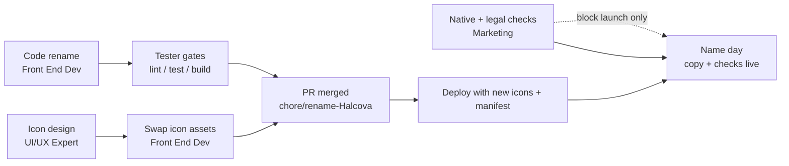

# Handoff — Halcova rebrand: who does what, in what order

**Owner:** Marketing Manager (coordinator) · **Status:** In flight · **Date:** 2026-08-12
**Decision:** rename public brand `Runout` → `Halcova` (locked).
**Branch for all code:** `chore/rename-Halcova` (off `main`) → PR. **Never `main`.**

> **Scope updated (2026-08-12): private-first.** Halcova launches as a **private
> friends & family test** with FR · NL · BR · DE testers (they double as the
> native-speaker name check for those markets). See
> `private-test-plan.md` + `private-test-invite.md`. "Name day" below = the
> **soft-open** to that circle; a wider launch is a later go/no-go.

---

## 1. Assignments

| Role / agent | Deliverable | Source of truth | Start? |
| --- | --- | --- | --- |
| **Front End Developer** | Code rename (wordmark, index.html, vite.config.js, README, docs) | `marketing/ticket-rename-Halcova.md` | ✅ can start now |
| **Tester** | Verify tests + gates after rename (`header-toolbar.test.jsx`, lint, build) | `ticket-rename-Halcova.md` §6 | after dev commit |
| **UI/UX Expert** | New icon mark (Figma → PNGs) | `marketing/brief-Halcova-icon.md` | ✅ can start now |
| **Marketing (me)** | Native-speaker check (7 languages) + legal/domain gate + copy | `name-check-Halcova-7-languages.md`, `rename-Halcova.md` §5 | ✅ can start now |
| **Project Manager** | Branch hygiene, PR, merge, "name day" coordination | this doc | at merge |

---

## 2. Dependency map

- **Parallel now:** code (A), icon (D), and checks (C) all start independently.
- **Blocking:** icon swap waits on icon approval; PR merge waits on green gates;
  **public launch ("name day") waits on native-speaker + legal + icon.**

---

## 3. Handoff details

### To the Front End Developer
- Use `ticket-rename-Halcova.md` — exact file/line scope, keep-list (§2), copy
  source (`copy-kit-Halcova.md` §3), verification (§6), definition of done (§7).
- **Do not** change internal identifiers (session/token keys, UA,
  `RUNOUT_ADMIN_KEY`, blob stores, `--runout-gold`).
- **Do not** change catalog `.copy` taglines (`"your crate, cataloged"` /
  `"your shelf, cataloged"`).
- Icon asset swap is a **later sub-task** once the icon is approved (do the code
  + manifest rename first; don't ship the stale Runout icon with the Halcova name).

### To the UI/UX Expert
- Use `brief-Halcova-icon.md` — concepts, maskable constraints, exact output
  paths, real dark/gold tokens.

### To the Tester
- After the rename commit: run `npm test` (wordmark assertion must read
  "Halcova"), `npm run lint`, `npm run build`; re-grep `src/` to confirm only
  internal identifiers remain (ticket §2 list).

### To Marketing (me)
- Run `name-check-Halcova-7-languages.md` (2 native speakers × 7 languages) and
  `rename-Halcova.md` §5 (trademark, domain, stores, handles). These **block
  launch, not code**.

---

## 4. "Name day" checklist (launch together)

- [ ] Icon approved and PNGs in `public/` (all 5 assets).
- [ ] Code + manifest merged (wordmark, `index.html`, `vite.config.js`).
- [ ] Native-speaker check green (7 languages).
- [ ] Legal/domain gate green.
- [ ] Deploy via `netlify deploy --build` (functions included — never drag-drop
      `dist`).
- [ ] Confirm installed home-screen name/icon updates on a device.
- [ ] Landing copy live from `copy-kit-Halcova.md`; UTM parameters on each channel.
- [ ] Start measuring **branded search %** ("Halcova app") — the rename KPI.
